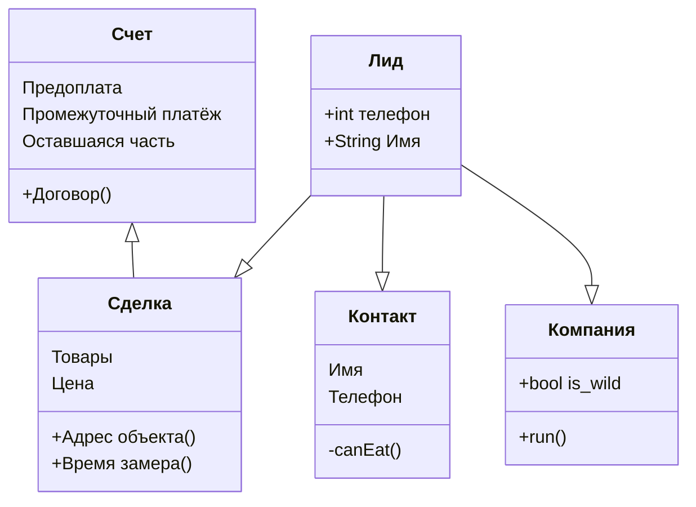

```mermaid
classDiagram
    Лид --|> Сделка
    Лид --|> Контакт
    Лид --|> Компания
    Счет <|-- Сделка
    Лид : +int телефон
    Лид : +String Имя
    class Сделка{
      Товары
      Цена
      +Адрес объекта()
      +Время замера()
    }
    class Контакт{
      Имя
      Телефон
      -canEat()
    }
    class Компания{
      +bool is_wild
      +run()
    }
    class Счет{
      Предоплата
      Промежуточный платёж
      Оставшаяся часть
      +Договор()
    }
```
