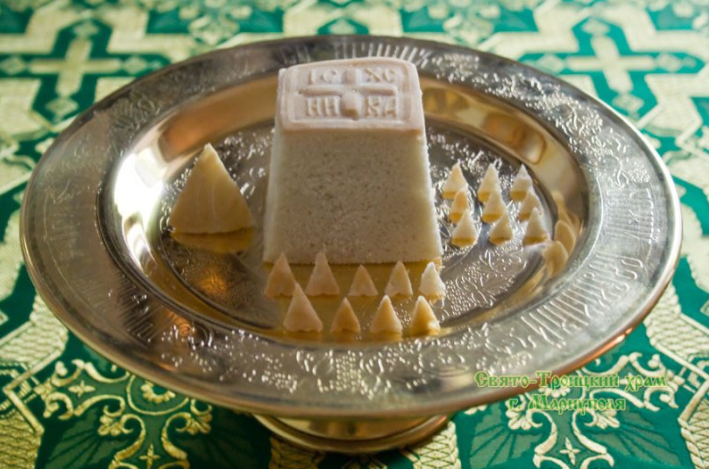
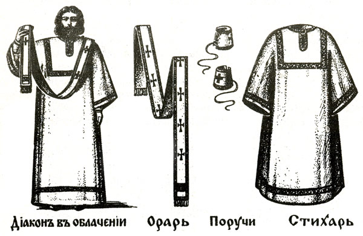

# Литургия оглашенных

---
Божественная литургия:
- Проскомидия
- Литургия оглашенных
- Литургия верных

---

---
[44](https://azbyka.ru/razmyshleniya-o-bozhestvennoj-liturgii#_ftnref44) _…пророков, апостола…_ – Имеются в виду священные христианские книги: ветхозаветных пророков, деяния и послания апостолов.

note: Вторая часть литургии называется литургией оглашенных. Как первая часть, проскомидия, соответствовала первоначальной жизни Христа, Его рождению, открытому только ангелам да немногим людям, Его младенчеству и пребыванию в сокровенной неизвестности до времени появленья в мир, – так вторая соответствует Его жизни в мире посреди людей, которых огласил Он словом истины. Называется она литургией оглашенных еще потому, что в первоначальные времена христиан к ней допускались и те, которые только готовились быть христианами, еще не приняли св. крещения и находились в числе оглашенных. Притом самый образ ее священнодействий, состоя из чтений пророков, Апостола[44](https://azbyka.ru/razmyshleniya-o-bozhestvennoj-liturgii#_ftn44) и св. Евангелия, есть уже преимущественно огласительный.

---
[45](https://azbyka.ru/razmyshleniya-o-bozhestvennoj-liturgii#_ftnref45) _…таинство Троицы…_ – Учение о Троице представляет собою первый догмат, установленный христианской церковью, суть его – утверждение триединства единосущного Бога – Отца, Сына и Святого Духа.

note: Иерей начинает литургию возглашеньем из глубины алтаря:
---
«Благословенно царство Отца, и Сына, и Святаго Духа…». 
---
Так как чрез воплощенье Сына стало миру очевидно ясно таинство Троицы[45](https://azbyka.ru/razmyshleniya-o-bozhestvennoj-liturgii#_ftn45), то по этому самому троичное возглашенье предшествует и предсияет начинанью всяких действий, и молящийся, отрешившися от всего, должен с первого разу поставить себя в царстве Троицы.

---
note: Стоя на амвоне, лицом к царским вратам, изобразуя в себе ангела, побудителя людей к моленьям, подняв тремя перстами десныя руки узкое лентие, – подобье ангельского крыла, – диакон призывает молиться весь собравшийся народ теми же самыми молитвами, которыми неизменно от апостольских времен молится Церковь, начиная с моленья о мире, без которого нельзя молиться. 

---

---

Собранье молящихся, знаменуясь крестом, стремясь обратить свои сердца в согласно настроенные струны органа, по которым должно ударять всякое воззванье диакона, восклицает мысленно вместе с хором поющих: «Господи, помилуй!»

---
[46](https://azbyka.ru/razmyshleniya-o-bozhestvennoj-liturgii#_ftnref46) _…великой эктенией…_ – Ектения – часть богослужения, состоящая из ряда молитвенных прошений.

note:  Стоя на амвоне, держа молитвенный орарь, изобразующий поднятое крыло ангела, стремящего людей к молитве, призывает диакон молиться: о свышнем мире и спасении душ наших, о мире всего мира, благостоянии святых Божиих церквей и соединении всех; о святом храме и о входящих в него с верой, благоговением и страхом; о государе, синоде, начальствах духовных и гражданских, палатах, воинстве, о граде, об обители, в которой служится литургия, о благорастворении воздухов, об обилии плодов земных, о временах мирных; о плавающих, путешествующих, недугующих, страждущих, плененных и о спасенье их, о избавлении нас от всякия скорби, гнева и нужды. И, собирая все сею всеобъемлющею цепью молений, называемою великой ектенией[46](https://azbyka.ru/razmyshleniya-o-bozhestvennoj-liturgii#_ftn46), на всякое ее отдельное призванье собранье молящихся восклицает вместе с хором поющих: «Господи, помилуй!».

---
[47](https://azbyka.ru/razmyshleniya-o-bozhestvennoj-liturgii#_ftnref47) _…совокупно с ликом…_ – В данном случае «лик» означает собрание поющих в храме.

note: В знаменованье бессилья наших молений, которым недостает душевной чистоты и небесной жизни, призывает диакон, – вспомня о тех, которые умели лучше нашего молиться, – предать самих себя, и друг друга, и всю жизнь нашу Христу Богу. В желанье искреннем предать самих себя, и друг друга, и всю жизнь нашу Христу Богу, как умели это сделать вместе с Богоматерью святые и лучшие нас, взывает вся церковь совокупно с ликом[47](https://azbyka.ru/razmyshleniya-o-bozhestvennoj-liturgii#_ftn47): «Тебе, Господи!» Цепь молений завершает диакон троичным славословием, которое, как вседержащая нить, проходит сквозь всю литургию, начиная и оканчивая всякое ее действие. Собранье молящихся ответствует утвердительным: «Аминь: Буди! да будет!» Диакон сходит с амвона; начинается пенье антифонов.

---
[48](https://azbyka.ru/razmyshleniya-o-bozhestvennoj-liturgii#_ftnref48) _…на обоих крылосах…_ – Клирос (крылос) – место в храме, где располагаются певчие, хор; клиросы находятся перед иконостасом, в северной и южной частях церкви.

note: Антифоны – противугласники, песни, выбранные из псалмов, пророчески изобразующие пришествие в мир Сына Божья, – поются попеременно обоими ликами на обоих клиросах[48](https://azbyka.ru/razmyshleniya-o-bozhestvennoj-liturgii#_ftn48); они заменили сокращенно прежние псаломские, более продолжительные.

Пока продолжается пенье первого антифона, священник молится в алтаре внутренней молитвой; а диакон стоит в молитвенном положении пред иконою Спасителя, подняв орарь тремя перстами руки. Когда же окончится пенье первого антифона, восходит он снова на амвон призывать собранье молящихся словами: «Вновь и вновь Господу помолимся!» Собранье молящихся восклицает: «Господи, помилуй!» Обратив взоры к ликам святых, диакон напоминает вспомнить вновь Богоматерь и всех святых, предать самих себя, и друг друга, и всю жизнь Христу Богу. Собранье восклицает: «Тебе, Господи!» Троичным славословием заключает он. Утвердительный «аминь» изглашает вся церковь. Следует пение второго антифона.

В продолженье второго антифона священник в алтаре молится внутреннею молитвою. Диакон становится опять в молитвенном положении пред иконой Спасителя, держа молитвенный орарь тремя перстами руки; по окончанье же пенья восходит он снова на амвон и обращается к ликам святых, призывая, как прежде, словами: «В мире Господу помолимся!» Собранье восклицает: «Господи, помилуй!» Диакон взывает: «Заступи, помилуй, спаси и сохрани нас, Боже, Твоею благодатию». Собранье восклицает: «Господи, помилуй!» Возведя глаза к ликам святых, диакон продолжает: «Пресвятую, пречистую, преблагословенную, славную владычицу нашу Богородицу со всеми святыми помянувше, сами себя, и друг друга, и весь живот наш Христу Богу предадим». Собранье восклицает: «Тебе, Господи!» Троичным славословием оканчивается моленье; утвердительным «Аминь» ответствует вся церковь; диакон сходит с амвона. А священник в закрытом олтаре молится внутренней молитвой; она – в сих словах: 

---

---
«Ты, даровавший нам сии общие и согласные молитвы! Ты, обещавший двум и трем собравшимся во имя Твое, подать прошенья! исполни же теперь к полезному прошенья рабов Твоих: подай в настоящем веке познанье Твоей истины, а в будущем даруй вечную жизнь!»

---
[49](https://azbyka.ru/razmyshleniya-o-bozhestvennoj-liturgii#_ftnref49) _…возглашаются во всеуслышанье блаженства…_ – Речь идет об основных положениях Нагорной проповеди Христа («Блаженны…» и т. д.;

---
см.: [Мф.5:3-12](http://azbyka.ru/biblia/?Mt.5:3-12)

---
); ниже Гоголь приводит их, сопровождая своими комментариями.

note:С крылоса громко возглашаются во всеуслышанье блаженства[49](https://azbyka.ru/razmyshleniya-o-bozhestvennoj-liturgii#_ftn49), возвестившие в настоящем веке познанье истины, а в будущем вечную жизнь. Собранье молящихся, взывая воззваньем благоразумного разбойника, возопившего к Христу на кресте: 

---
«Во царствии Твоем помяни нас. Господи, егда приидеши во царствии Твоем», повторяет вослед за чтецом сии слова Спасителя: 
---
«Блаженны нищие духом, яко тех есть царствие небесное» – не гордящиеся, не возносящиеся умом.
---
«Блаженны плачущие, яко тии утешатся» – плачущие еще больше о собственных несовершенствах и прегрешениях, чем от оскорблений и обид, им наносимых.
---
«Блаженны кроткие, яко тии наследят землю» – не питающие гнева ни противу кого, всепрощающие, любящие, которых оружие – всепобеждающая кротость.
---
«Блаженны алчущие и жаждущие правды, яко тии насытятся» – алчущие небесной правды, жаждущие восстановить ее прежде в самих себе.
---
«Блаженны милостивые, яко тии помилованы будут» – состраждущие о каждом брате, в каждом просящем видящие самого Христа, за него просящего.
---
«Блаженны чистые сердцем, яко тии Бога узрят» – как в чистом зеркале успокоенных вод, не возмущаемых ни песком, ни тиной, отражается чисто небесный свод, так и в зеркале чистого сердца, не возмущаемого страстями, уже нет ничего человеческого, и образ Божий в нем отражается один.
---
«Блаженны миротворцы, яко тии сынове Божии нарекутся» – подобно самому Сыну Божию, сходившему на землю затем, чтобы внести мир в наши души: так и вносящие мир и примиренье в домы – истинные Божьи сыны.
---
«Блаженны изгнанные правды ради, яко тех есть царствие небесное» – изгнанные за возвещенье правды не одними устами, но благоуханьем всей своей жизни.
---
«Блаженны есте, егда поносят вас и изженут и рекут всяк зол глагол на вы лжуще Мене ради. Радуйтеся и веселитеся, яко мзда ваша многа на небесах» – многа, ибо заслуга их троекратна: первая – что уже сами по себе они были невинны и чисты; вторая – что, быв чисты, были оклеветаны; третья – что, быв оклеветаны, радовались, что потерпели за Христа.
---

Собранье молящихся слезно повторяет вослед за чтецом сии слова Спасителя, возвестившие, кому можно ждать и надеяться на вечную жизнь в будущем веке, которые суть истинные цари мира, сонаследники и соучастники небесного царства.

Здесь торжественно открываются царские врата, как бы врата самого царствия небесного, и глазам всех собравшихся предстает сияющий престол, как селенье Божией славы и верховное училище, отколе исходит к нам познанье истины и возвещается вечная жизнь. Приступив к престолу, священник и диакон снимают с него Евангелие и несут его к народу не царскими вратами, но позади олтаря боковой дверью, напоминающей дверь в той боковой комнате, из которой в первые времена выносились книги на середину храма для чтения.

---

Собрание молящихся взирает на Евангелие, несомое в руках смиренных служителей церкви, как бы на Самого Спасителя, исходящего в первый раз на дело божественной проповеди: исходит Он тесной северной дверью, как бы неузнанный, на середину храма, дабы, показавшись всем, возвратиться во святилище Царскими Вратами. Служители Божьи посреди храма останавливаются; оба преклоняют главы. Иерей молится внутреннею молитвой, чтобы Установивший на небесах воинства ангелов и чины небесные в служенье славы своей повелел теперь сим самым силам и ангелам небесным, сослужащим нам, совершить вместе с ними вшествие во святилище. А диакон, указывая молитвенным орарем на царские двери, говорит ему: «Благослови, владыко, святый вход!» – «Благословен вход святых Твоих, всегда, ныне и присно, и во веки веков!» – возглашает на это иерей. Дав поцеловать ему святое Евангелие, диакон несет его в олтарь; но в царских вратах останавливается и, возвысив его в руках своих, возглашает: «Премудрость!» – знаменуя сим, что Слово Божье, Его Сын, Его Вечная Премудрость благовестилась миру, чрез Евангелие, которое он теперь возвысил в своих руках. И вслед за тем возглашает: «Прости!» – т. е. воспряньте, воздвигнитесь от лени, от небрежного стоянья. Собрание молящихся, воздвигаясь духом, вместе с хором взывает: «Придите, поклонимся и припадем ко Христу! Спаси нас, Сыне Божий, Тебе поющих: Аллилуия!» В еврейском слове аллилуия выражается: «Господь идет, хвалите Господа»; но так как по существу священного языка в слове идет сокрыто и настоящее и будущее, то есть: идет пришедший и вновь грядущий, то, знаменуя вечное хождение Божие, это слово аллилуия сопутствует всякий раз тем священнодействиям, когда Сам Господь исходит к народу в образе Евангелия или Даров Святых.

---
[50](https://azbyka.ru/razmyshleniya-o-bozhestvennoj-liturgii#_ftnref50) _…хвалебные тропари…_ – Тропарь – одно из церковных песнопений.

note: Евангелие, возвестившее слово жизни, поставляется на престоле. На крылосах раздаются или песни в честь праздника того дня, или же хвалебные тропари[50](https://azbyka.ru/razmyshleniya-o-bozhestvennoj-liturgii#_ftn50) и гимны в честь святому, которого день празднует церковь за то, что он уподобился тем, которых поименовал Христос в прочитанных блаженствах, и что живым примером собственной жизни показал, как возлегать вослед за ним в жизнь вечную. 

По окончанье тропарей наступает время трисвятого пенья. Испросив на него у иерея благословенья, диакон показывается в царских дверях и, поводя орарем, подает знак певцам. Торжественно-громогласно оглашает всю церковь трисвятое пенье, состоящее в сем тройном воззванье к Богу: «Святый Боже, святый крепкий, святый бессмертный, помилуй нас!» Воззваньем: «Святый Боже» возвещает трисвятая песнь Бога Отца; воззваньем: «святый крепкий» – Бога Сына: Его крепость, Его создающее слово; воззваньем: «святый бессмертный» – Его бессмертную мысль, вечно живущую волю Бога Духа Святого. Троекратно певцы подъемлют сие пение, чтобы звучало в слух всем, что с вечным пребываньем Бога пребывало в Нем вечное пребыванье Троицы, и не было времени, чтобы у Бога не было Слова и чтобы Слову Его оскудевал Дух Святый. «Словом Божьим небеса создашася и духом уст Его вся сила их», – говорит пророк Давид. Каждый из собранья, сознавая, что и в нем, как в подобье Божьем, есть та же троинственность, есть Он Сам, Его Слово и Его Дух, или мысль, движущая словом, но что человеческое его слово бессильно, изливается праздно и не творит ничего, а дух его принадлежит не ему, завися от всех посторонних впечатлений и только по возвышенье его самого к Богу то и другое приходит в нем в силу: в слове отражается Божье Слово, в духе – Дух Божий, и образ Троицы Создавшего отпечатлевается в создании, и создание становится подобным Создателю, – сознавая все сие, каждый, внемлющий трисвятому пенью, молится внутренно в себе, чтобы Бог святый, крепкий и бессмертный, очистив его всего, избрал его своим храмом и пребываньем, и три раза повторяет в себе: «Святый Боже, святый крепкий, святый бессмертный, помилуй нас!» Священник в олтаре, молясь внутренней молитвой о принятии сего трисвятого пенья, три раза повергается перед престолом и три раза повторяет в себе: «Святый Боже, святый крепкий, святый бессмертный!» И подобно ему повторив в себе три раза ту же трисвятую песнь, диакон три раза повергается вместе с ним перед святым престолом.

---
[51](https://azbyka.ru/razmyshleniya-o-bozhestvennoj-liturgii#_ftnref51) _…возрожденье, прозретое издали пророком Даниилом…_ – Даниил – ветхозаветный пророк эпохи вавилонского пленения (VI в. до н. э.); предсказал освобождение иудейского народа из плена, восстановление Иерусалима и храма, приход «Христа Великого», предание его смерти и новое разрушение «города и святилища» (см.: [Дан.9:25-26](http://azbyka.ru/biblia/?Dan.9:25-26)). У Гоголя парафраз следующего места из Книги Пророка Даниила: «Видел я в ночных видениях, вот, с облаками небесными шел как бы Сын человеческий, дошел до Ветхого днями и подведен был к нему» ([Дан.7:13](http://azbyka.ru/biblia/?Dan.7:13)).

note:И, сотворив поклонение, отходит иерей на горнее место, как бы во глубину Боговедения, отколе истекла нам тайна всесвятыя Троицы, как бы в то возвышеннейшее, всюду носящее место, где Сын пребывает в лоне Отчем единством Духа Святого. И восхожденьем своим изобразует иерей восхожденье Самого Христа вместе с плотью в лоно Отчее, призывающее человека вослед стремиться в лоно Отчее, – возрожденье, прозретое издали пророком Даниилом[51](https://azbyka.ru/razmyshleniya-o-bozhestvennoj-liturgii#_ftn51), который видел в высоком виденье своем, как Сын человеческий дошел даже до Ветхого деньми. Иерей идет нетрепетной стопой, произнося: 

---
«Благословен грядый во имя Господне», и на призванье диакона: «Благослови, владыко, горний престол», благословляет его, произнося: «Благословен еси на престоле славы царствия Твоего, седяй на херувимех всегда, ныне и присно, и во веки веков».

---
[52](https://azbyka.ru/razmyshleniya-o-bozhestvennoj-liturgii#_ftnref52) _…на горнем месте…_ – Горнее место – сиденье в алтаре к востоку от престола, предназначенное для архиерея.

note: И садится на горнем месте[52](https://azbyka.ru/razmyshleniya-o-bozhestvennoj-liturgii#_ftn52) возле седалища, назначенного для архиерея. Отселе, как Божий апостол и его наместник, обратясь лицом к народу, приготовляет он вниманье к слушанью наступающего чтенья апостольских посланий, – сидящий, изобразуя самим сиденьем своим свое равенство апостолам.

Чтец, с апостолом в руке, выходит на середину храма. Воззваньем: «вонмем!» призывает диакон всех предстоящих ко вниманию. Священник посылает из глубины олтаря и чтецу, и предстоящим желание мира; собранье молящихся ответствует священнику тем же. Но так как служенье его должно быть духовно, подобно служенью апостолов, которые глаголали не свои слова, но сам Дух Святый двигал их устами, то не говорят: «мир тебе», но: «духови твоему». 

---
[53](https://azbyka.ru/razmyshleniya-o-bozhestvennoj-liturgii#_ftnref53) _…лествицей…_ – лестницей.

note:  Диакон возглашает: «Премудрость!» Громко, выразительно, чтобы всякое слово было слышно всем, начинает чтец; прилежно, сердцем приемлющим, душою ищущею, разумом, испытующим внутренний смысл читаемого, внемлет собранье, ибо чтенье апостола служит ступенью и лествицей[53](https://azbyka.ru/razmyshleniya-o-bozhestvennoj-liturgii#_ftn53) к лучшему уразумленью чтенья евангельского. Когда чтец окончит чтенье, иерей возглашает ему из олтаря: «мир тебе». Лик ответствует: «и духови твоему». Диакон возглашает: «Премудрость!» Лик гремит: «аллилуия», возвещающее приближенье Господа, идущего говорить народу устами Евангелия.

С кадильницей в руке идет диакон исполнить благоуханьем храм, навстречу идущего Господа, напоминая каждому о духовном очищенье душ наших, с каким должны мы внимать благоуханным словам Евангелия. Священник в олтаре молится внутренней молитвой, чтобы воссиял в сердцах наших свет божественного благоразумия и отверзлись бы наши мысленные очи в уразуменье евангельских проповеданий. О воссиянье того же света в сердцах своих молится внутренне собранье, приготовляясь к слушанью. Испросив благословенья от иерея, получа от него в напутствие: «Бог молитвами всесвятаго, всехвальнаго апостола и евангелиста (именуется его имя) да даст тебе глагол благовествующему силою многою, во исполнение евангелия, возлюбленнаго Сына Своего, Господа нашего Иисуса Христа», диакон восходит на амвон, предшествуемый несомым светильником, знаменующим всепросвещающий свет Христов. Священник в олтаре возглашает к собранью: «Премудрость! Прости, услышим Святаго Евангелия! Мир всем!» Лик ответствует: «и духови твоему». Диакон начинает чтенье.

---
6 кл. [54](https://azbyka.ru/razmyshleniya-o-bozhestvennoj-liturgii#_ftnref54) _…не теми сердцами…_ – Здесь Гоголь пересказывает евангельскую притчу о сеятеле (см.: Матф., 13, 3–23).

note:Благоговейно преклонив головы, как бы внимая самому Христу, говорящему с амвона, все стараются принять сердцами семя святого слова, которое устами служителя сеет сам Сеятель Небесный, – не теми сердцами[54](https://azbyka.ru/razmyshleniya-o-bozhestvennoj-liturgii#_ftn54), которых уподобляет Спаситель земле при пути, на которую хоть и упадают семена, но тут же бывают расхищены птицами – налетающими злыми помышлениями; – не теми также сердцами, которых уподобляет Он каменистой почве, только сверху прикрытой землею, которые хоть и охотно приемлют слова, но слово не водружает глубоко корня, ибо нет глубины сердечной; – и не теми также сердцами, которые уподобляет Он неочищенной земле, глушимой тернием, на которой хоть и дает семя всходы, но быстро вырастающие тут же вместе с ними тернии, – тернии трудов и забот века, тернии обольщений, бесчисленные обаяния светской умерщвляющей жизни с ее обманчивыми удобствами, заглушают едва поднявшиеся всходы – и семя остается без плода;

---
[55](https://azbyka.ru/razmyshleniya-o-bozhestvennoj-liturgii#_ftnref55) _…ово сто…_ – Ово (ц.-сл.) – либо, или.

note: – но теми приемлющими сердцами, которых уподобляет Он доброй почве, дающей плод – ово сто[55](https://azbyka.ru/razmyshleniya-o-bozhestvennoj-liturgii#_ftn55), ово шестьдесят, ово тридесят, – которые все, принятое в себя, по выходе из церкви, возвращают в домах, в семье, в службе, в труде, в отдохновеньях, в увеселеньях, с людьми в беседах и наедине с самим собою. 

---
[56](https://azbyka.ru/razmyshleniya-o-bozhestvennoj-liturgii#_ftnref56) _…всяк верный…_ – исповедующий истинную веру.

note: Словом, всяк верный[56](https://azbyka.ru/razmyshleniya-o-bozhestvennoj-liturgii#_ftn56) стремится быть тем, и слушающим и творящим вместе, которого обещает Спаситель уподобить мужу мудру, строящему храмину не на песке,

---
<small>[57](https://azbyka.ru/razmyshleniya-o-bozhestvennoj-liturgii#_ftnref57) _…мужу мудру, строящему храмину не на песке, но на камени…_ – Гоголь напоминает заключительную часть Нагорной проповеди Христа: «Итак всякого, кто слушает слова Мои сии и исполняет их, уподоблю мужу благоразумному, который построил дом свой на камне; и пошел дождь, и разлились реки, и подули ветры, и устремились на дом тот, и он не упал, потому что основан был на камне. А всякий, кто слушает сии слова Мои и не исполняет их, уподобится человеку безрассудному, который построил дом свой на песке; и пошел дождь, и разлились реки, и подули ветры, и налегли на дом тот; и он упал, и было падение его великое» (Матф., 7, 24–27).</small>

note:  но на камени[57](https://azbyka.ru/razmyshleniya-o-bozhestvennoj-liturgii#_ftn57), так что, если бы тут же, по «выходе из церкви, набежали на него дожди, реки и вихри всех бедствий, его духовная храмина осталась бы неподвижная, как твердыня на камени. По окончанье чтенья, священник в олтаре возвещает диакону: «Мир тебе благовествующему». Приподымая головы, все предстоящие в чувствований благодарности восклицают вместе с ликом: «Слава Тебе, Боже наш! Слава Тебе!» Стоящий в царских дверях священник приемлет от диакона Евангелие и поставляет его на престол, как Слово, исшедшее от Бога и к Нему же возвратившееся.

---
[58](https://azbyka.ru/razmyshleniya-o-bozhestvennoj-liturgii#_ftnref58) _…нет других дверей в царство небесное…_ – С этим местом «Размышлений» перекликаются слова Гоголя из его предсмертной записки: «Нет другой двери, кроме указанной Иисусом Христом…» (Письма Н. В. Гоголя в 4‑х томах, т. IV. СПб., 1901, с. 424).

note:   Олтарь, изобразующий высшие горние селенья, скрывается от глаз – врата царские затворяются, горняя дверь задергивается, знаменуя, что нет других дверей в Царство Небесное[58](https://azbyka.ru/razmyshleniya-o-bozhestvennoj-liturgii#_ftn58), кроме отверстых Христом, что с Ним только можно войти в них: «Аз есмь дверь».

Тут обыкновенно в первоначальное время христиан было место проповеди; следовали изъясненье и толкованье прочитанных Евангелий. Но так как проповедь в нынешнее время говорится большею частию на другие тексты и, стало быть, не служит изъяснением прочитанного Евангелия, то, чтобы не разрушать стройного порядка и связи священной литургии, она отнесена к концу.

---
[59](https://azbyka.ru/razmyshleniya-o-bozhestvennoj-liturgii#_ftnref59) _…пройти честно свое земное поприще…_ – параллель к теме поприща в «Выбранных местах из переписки с друзьями» («Нужно проездиться по России», «Занимающему важное место») и «Развязке Ревизора».

note: Изобразуя ангела, побудителя людей к моленьям, диакон идет на амвон воздвигнуть собранье к моленьям еще сильнейшим и прилежнейшим. «Рцем вси от всея души, и от всего помышления нашего рцем!» – взывает он, подъемля тремя перстами молитвенный орарь; и, стремя моленья от всех помышлений, все восклицают: «Господи, помилуй!» Усугубляя моленья троекратным воззваньем о помилованье, диакон призывает сызнова молиться о всех людях, находящихся на всех ступенях званий и должностей, начиная с высших, где трудней человеку, где ему больше преткновений и где ему нужней помощь от Бога. Каждый из собранья, зная, как много благоденствие многих зависит от того, когда высшие власти исполняют честно свои обязанности, молится сильно о том, чтобы Бог их вразумил и наставил исполнять честно свое званье и всякому подал бы силы пройти честно свое земное поприще[59](https://azbyka.ru/razmyshleniya-o-bozhestvennoj-liturgii#_ftn59). О сем молятся все прилежно, произнеся уже не один раз: «Господи, помилуй», но три раза. Вся цепь этих молений называется сугубой ектеньей, или эктенией прилежного моленья, и священник в олтаре перед престолом молится прилежно о принятии всеобщих усугубленных молений, и самая молитва его называется молитвой прилежного моленья.

И если в тот день случится какое-либо приношенье об усопших, тогда вослед за сугубой эктенией возглашается эктения об усопших. Держа орарь тремя перстами руки, призывает диакон молиться об успокоенье душ Божьих рабов, которых всех называет по именам, чтобы Бог простил им всякое прегрешение, вольное и невольное, чтобы водворил их души там, где праведные успокояются. Тут всякий из предстоящих припоминает всех близких своему сердцу усопших и произносит в себе три раза на всякое воззванье диакона: «Господи, помилуй!», молясь прилежно и о своих, и о всех почивших христианах. «Милости Божией», восклицает диакон: «небеснаго царствия и оставления грехов их у Христа, бессмертнаго царя и Бога нашего, просим!» Собранье взывает с хором поющих: «Подай, Господи!» А священник молится в олтаре, чтобы Поправший смерть и Даровавший жизнь успокоил Сам души усопших рабов своих в месте злачном, в месте покойном, откуда отбежали болезнь, печаль и воздыхание, и, прося им в сердце своем отпущенья всех согрешений, возглашает громко: «Яко Ты еси воскресение, и жизнь, и покой усопших рабов Твоих, Христе, Боже наш, и Тебе славу воссылаем со безначальным Твоим Отцем, и пресвятым, и благим, и животворящим Твоим Духом, ныне и присно, и во веки веков». Утвердительным «аминь» ответствует лик. Диакон начинает эктению об оглашенных.

Хотя и редко бывают теперь не принявшие святого крещения и находящиеся в числе оглашенных, но всякий присутствующий, помышляя, как далеко он отстоит и верой, и делами от верных, удостоившихся соприсутствовать трапезе любви в первые веки христиан, видя, как он, можно сказать, только огласился Христом, но не внес Его в самую жизнь, только что слышит разум слов Его, но не приводит их в исполнение, и еще холодно его верованье, и нет огня всепрощающей любви к брату, поядающей душевную черствость, и что, крещенный водой во имя Христа, он не достигнул того возрожденья в духе, без которого ничтожно его христианство, по слову Самого Спасителя: «Кто не родится свыше, не внидет в царствие небесное», – соображая все сие, всякий из присутствующих сокрушенно поставляет себя в число оглашенных и на призванье диакона: «Помолитеся, оглашенные, Господу!» от глубины сердца взывает: «Господи, помилуй!»

«Верные!» взывает диакон: «помолимся об оглашенных, чтобы Господь их помиловал, чтобы огласил их словом истины, чтобы открыл им евангелие правды, чтобы соединил их Своей святой соборной и апостольской Церкви, чтобы спас, помиловал, заступил и сохранил их своею благодатью!»

И верные, чувствующие, как мало они стоят названия верных, молясь об оглашенных, молятся о самих себе, и на всякое отдельное призванье диакона восклицают внутренне вослед за поющим ликом: «Господи, помилуй!» Диакон взывает: «Оглашенные, главы ваши Господу преклоните!» Все преклоняют свои головы, восклицая внутренне в сердцах: «Тебе, Господи!»

Священник втайне молится об оглашенных и о тех, которых смиренье души поставило себя в ряды оглашенных. Молитва его в сих словах: «Господи Боже наш, живущий на высоких, взирающий на смиренных, ниспославший спасенье человеческому роду – своего Сына, Бога и Господа нашего, Иисуса Христа! воззри на оглашенных рабов Твоих, подклонивших Тебе свои выи! Приобщи их Церкви Твоей и сопричисли Твоему избранному стаду, чтобы и они славили вместе с нами пречестное и великолепное имя Твое, Отца, и Сына, и Святаго Духа, ныне и присно, и во веки веков». Лик гремит: «Аминь». А в напоминанье, что наступила минута, в которую древле выводились из церкви оглашенные, диакон возглашает громко: «Оглашенные, изыдите!» И вслед за тем, возвысив голос, возглашает в другой раз: «Оглашенные, изыдите!» И потом в третий раз: «Оглашенные, изыдите! да никто от оглашенных, одни только верные, вновь и вновь Господу помолимся!»

От слов этих содрогаются все, чувствующие свое недостоинство. Взывая мысленно к самому Христу, изгнавшему из храма Божия продавцев и бесстыдных торгашей, обративших в торжище Его святыню, каждый предстоящий старается изгнать из храма души своей оглашенного, не готового присутствовать при святыне, и взывает к самому Христу, чтобы воздвигнул в нем верного, причисленного к избранному стаду, о котором сказал Апостол: «Язык свят, люди обновления, камение, зиждущееся в храм духовен», – причисленного к тем истинно верным, которые присутствовали при литургии в первые веки христиан, которых лики глядят теперь на него с иконостаса. И, объемля их всех взорами, призывает их на помощь, как братьев, молящихся теперь на небесах, ибо предстоят священнейшие действия – начинается литургия верных.
