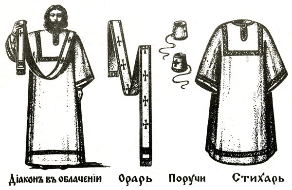

# Урок 16. Литургия святого Иоанна Златоуста. 

## Проскомидия.

The Liturgy of St. John Chrysostom. Proskomedia

<small>А. Ф. Протопопов. «Детский доктор». 1885 г.</small>

note: Гоголь имел большое воспитательное значение для России. Он ставил себе сверхзадачу — переменить нрав целого народа при помощи литературного творчества. Из некоторых картин 19 века видно, что Гоголь для России XIX в. был кем-то вроде Данте или Коллоди для Италии, видно какое воспитательное значение имели его произведения. 

«Он был живописателем действительности печальной, вопиющей, пошлой, изобразителем прозы жизненной, той трясины суетной, в которую засасываются люди и в которой гибнут и глохнут все добрые их инстинкты, силы и дарования», пишет о нем [протоиерей Павел ДЕРНОВ](https://tatmitropolia.ru/all_publications/publication/?id=67167) , он был очень строг к себе, не увлекался дешевым успехом... и становится в разлад с окружающими и с самим собою, со своими первыми, недостаточно, как ему казалось, серьезными и публикой не понятыми и превратно истолкованными сочинениями. 

«"Ревизор", многие воспринимали просто как сатирическое произведение, обличающее нравы? Гоголь многократно пытался объяснить, что он вкладывал более глубокий смысл в это произведение, что каждый должен на свою душу посмотреть, что все эти чиновники олицетворяют собой страсти, господствующие в человеке, а настоящий ревизор - это истинная совесть, в отличие от "ветреной совести", которую олицетворяет Хлестаков.» пишет о Гоголе  [Иеромонах Симеон (Томачинский) - директор издательства Сретенского монастыря](https://www.pravoslavie.ru/37345.html). — это даёт повод читать его произведения их на уроках ОПВ в православной гимназии. и говорить о большом катехизаторском и миссионерском значении произведений Н.В. Гоголя.

---
[1](https://azbyka.ru/razmyshleniya-o-bozhestvennoj-liturgii#_ftnref1) _Предисловие._ – Заголовок этого чернового наброска дан Н.Тихонравовым.

note: Цель этой книги – показать, в какой полноте и внутренней глубокой связи совершается наша литургия, юношам и людям, еще начинающим, еще мало ознакомленным с ее значением. Из множества объяснений, сделанных Отцами и Учителями, выбраны здесь только те, которые доступны всем своей простотою и доступностью, которые служат преимущественно к тому, чтобы понять необходимый и правильный исход одного действия из другого. Намеренье издающего эту книгу состоит в том, чтобы утвердился в голове читателя порядок всего. Он уверен, что всякому, со вниманием следующему за литургиею, повторяя всякое слово, глубокое внутреннее значенье ее раскрываться будет само собою. Все прочие, которые бы захотели узнать более таинственные и глубокие объяснения, могут найти их в сочинениях патриарха Германа

---
[2](https://azbyka.ru/razmyshleniya-o-bozhestvennoj-liturgii#_ftnref2) _…патриарха Германа…_ – Герман, патриарх Константинопольский (VIII в.); признан святым на Седьмом вселенском соборе в 788 г. Известен как первый защитник иконопочитания в эпоху гонения на иконы.

---
[3](https://azbyka.ru/razmyshleniya-o-bozhestvennoj-liturgii#_ftnref3) _…Иеремии…_ – Имеется в виду, по всей вероятности, Иеремия II, патриарх Константинопольский (XVI в.). Его полемический «Ответ лютеранам», один из разделов которого называется «Об употреблении таинств», Гоголь мог прочесть в журнале «Христианское чтение» (1842, ч. I), которым очень интересовался.

---
[4](https://azbyka.ru/razmyshleniya-o-bozhestvennoj-liturgii#_ftnref4) _…[Николая Кавасила](https://azbyka.ru/otechnik/Nikolaj_Kavasila/ "Николай Кавасила, праведный")(ы)…_ – Николай Кавасила, митрополит Солунский (XIV в.), автор «Изъяснения на литургию» и других богословских сочинений.

---
[5](https://azbyka.ru/razmyshleniya-o-bozhestvennoj-liturgii#_ftnref5) _…[Симеона Солунского](https://azbyka.ru/otechnik/Simeon_Solunskij/ "Симеон Солунский, святитель")…_ – Симеон, архиепископ Солунский, митрополит Фессалонитский (XV в.), крупнейший писатель и богослов греческой церкви, автор классических трудов по литургике.

---
[6](https://azbyka.ru/razmyshleniya-o-bozhestvennoj-liturgii#_ftnref6) _…Старой и Новой Скрижали…_ – «Новая скрижаль, или Объяснение о Церкви, о литургии и о всех службах и утварях церковных», сочинение Вениамина (Румовского-Краснопевкова), архиепископа Нижегородского и Арзамасского (ум. в 1811 г.), выдержавшее несколько изданий. В авторском «Предисловии» есть упоминание о книге, «давно изданной и именуемой «Скрижаль», в которой, «как в таблице», содержится «только оглавление предметов, с кратким их объяснением» (с. IX).

---
[7](https://azbyka.ru/razmyshleniya-o-bozhestvennoj-liturgii#_ftnref7) _…в объяснениях Дмитриева…_ – Неточность Гоголя; речь, несомненно, идет о книге известного духовного писателя XVIII в. И. Дмитревского «Историческое и таинственное изъяснение на Литургию…». Гоголь мог пользоваться третьим ее изданием (М., 1823).

---

[8](https://azbyka.ru/razmyshleniya-o-bozhestvennoj-liturgii#_ftn8) _Вступление._ – Заглавие отрывка дано Гоголем, когда он начал (но не окончил) переписывать черновой набросок в основную тетрадь.

note: Божественная литургия есть вечное повторение великого подвига любви, для нас совершившегося. Скорбя от неустроений своих, человечество отовсюду, со всех концов мира, взывало к Творцу своему – и пребывавшие во тьме язычества и лишенные боговедения – слыша, что порядок и стройность могут быть водворены в мире только Тем, который в стройном чине повелел двигаться мирам, от Него созданным. Отовсюду тоскующая тварь звала своего Творца. Воплями взывало все к Виновнику своего бытия, и вопли эти слышней слышались в устах избранных и пророков. Предчувствовали и знали, что Создатель, скрывающийся в созданьях, предстанет сам лицом к человекам, – предстанет не иначе, как в образе того созданья своего, созданного по Его образу и подобию. Вочеловечение Бога на земле представлялось всем, по мере того, как сколько-нибудь очищались понятия о божестве. Но нигде так ясно не говорилось об этом, как у пророков богоизбранного народа. И самое чистое воплощение Его от чистой Девы было предслышиваемо даже и язычниками; но нигде в такой ощутительно видной ясности, как у пророков.

---

note: Вопли услышались: явился в мир, Им же мир бысть; среди нас явился в образе человека, как предчувствовали, как предслышали и в темной тьме язычества, но не в том только, в каком представляли Его неочищенные понятия – не в гордом блеске и величии, не как каратель преступлений, не как судия, приходящий истребить одних и наградить других. Нет! послышалось кроткое лобзание брата. Совершилось Его появление образом, только одному Богу свойственным, как прообразовали Его божественно пророки, получившие повеление от Бога…

---
## Проскомидия

note: Священник, которому предстоит совершать литургию, должен еще с вечера трезвиться телом и духом, должен быть примирен со всеми, должен опасаться питать какое-нибудь неудовольствие на кого бы то ни было. Когда же наступит время, идет он в [церковь](https://azbyka.ru/1/tserkov "Церковь"); вместе с диаконом поклоняются они оба пред царскими вратами

---

[9](https://azbyka.ru/razmyshleniya-o-bozhestvennoj-liturgii#_ftnref9) _…пред царскими вратами…_ – Царские, или средние, врата – одна из трех (главная) дверей в иконостасе, ведущих из алтаря в храм.

note: целуют образ Спасителя, целуют образ Богородицы, поклоняются ликам святых всех, поклоняются всем предстоящим

---
[10](https://azbyka.ru/razmyshleniya-o-bozhestvennoj-liturgii#_ftnref10) _…предстоящим…_ Молящиеся, стоящие перед иконостасом.

note: направо и налево, испрашивая сим поклоном себе прощения у всех, и входят в олтарь

---
[11](https://azbyka.ru/razmyshleniya-o-bozhestvennoj-liturgii#_ftnref11) _Олтаръ (алтарь)_ – главная, восточная, часть церкви, отделенная от остальных ее частей иконостасом и царскими вратами; входить в алтарь разрешено только священнослужителям.

note: произнося в себе псалом «Вниду в дом Твой, поклонюся храму Твоему во страсе Твоем».

---

[12](https://azbyka.ru/razmyshleniya-o-bozhestvennoj-liturgii#_ftnref12) _Псалом_ – священное ветхозаветное песнопение.

note: И, приступив к престолу лицом к востоку, повергают пред ним три наземные поклоны и целуют на нем пребывающее евангелие, как бы самого Господа, сидящего на престоле; целуют потом и самую трапезу и приступают к облачению себя в священные одежды, чтобы отделиться не только от других людей, – и от самих себя, ничего не напомнить в себе другим похожего на человека, занимающегося ежедневными житейскими делами. И произнося в себе: «Боже! очисти меня грешнаго и помилуй меня!», священник и диакон берут в руки одежды. Сначала одевается диакон; испросив благословение у иерея

---

[13](https://azbyka.ru/razmyshleniya-o-bozhestvennoj-liturgii#_ftnref13) _…у иерея…_ – Иерей – в переводе с греческого «священник».

---

[14](https://azbyka.ru/razmyshleniya-o-bozhestvennoj-liturgii#_ftnref14) _…надевает стихарь, подризник блистающего цвета, во знаменование светоносной ангельской одежды и в напоминание непорочной чистоты сердца, какая должна быть неразлучна с саном священства…_ – Стихарь, или подризник, – одеяние священника и дьякона, обычно белого цвета.

note: почему и произносит при воздевании его: «Возрадуется душа моя о Господе, облече бо мя в ризу спасения и одеждою веселия одея мя; яко жениху, возложи ми венец и, яко невесту, украси мя красотою». – Затем берет, поцеловав, орарь, узкое длинное лентие

---

note: принадлежность диаконского звания, которым подает он знак к начинанью всякого действия церковного, воздвигая народ к молению, певцов к пению, священника к священнодействию, себя к ангельской быстроте и готовности во служении. Ибо званье диакона, что званье ангела на небесах, и самым сим на него воздетым тонким лентием, развевающимся как бы в подобие воздушного крыла, и быстрым хождением своим по церкви изобразует он, по слову Златоуста ангельское летание.

---

Иоанн Златоуст (IV в.), один из отцов и учителей христианской церкви, выдающийся богослов. и церковный писатель, проповедник. Признан церковью святым.

note: Лентие это, поцеловав, он набрасывает себе на плечо. Потом надевает он поручи, или нарукавницы, которые стягиваются у самой кисти его руки для сообщенья им большей свободы и ловкости в отправлении предстоящих священнодействий. 

---

note: Надевая их, помышляет о всетворящей, содействующей повсюду силе Божией и, воздевая на правую, произносит он: «Десница Твоя, Господи, прославилася в крепости; десная рука Твоя, Господи, сокрушила врагов, и множеством славы Своей Ты истребил супостатов». Воздевая на левую руку, помышляет о самом себе как о творении рук Божиих и молит у Него же, его же сотворившего, да руководит его верховным, свышним Своим руководством, говоря так: «Руки Твои сотворили и создали мя. Вразуми меня, и научуся Твоим заповедям».

---

note: Священник облачается таким же самым образом. Вначале благословляет и надевает стихарь, сопровождая сие теми же словами, какими сопровождал и диакон; но, вслед за стихарем, надевает уже не простой одноплечный орарь, но двухплечный, который, покрыв оба плеча и обняв шею, соединяется обоими концами на груди его вместе и сходит в соединенном виде до самого низу его одежды, знаменуя сим соединение в его должности двух должностей – иерейской и диаконской. И называется он уже не орарем, но эпитрахилью

---

note: и самим воздеваньем своим знаменует излияние благодати свыше на священников, почему и сопровождается это величественными словами Писания: «Благословен Бог, изливающий благодать свою на священники своя, яко миро на главе, 

---
[18](https://azbyka.ru/razmyshleniya-o-bozhestvennoj-liturgii#_ftnref18) _Миро_ – благовонная смесь; в православной церкви составляется из многих (иногда до нескольких десятков) компонентов – елея и других масел, белого виноградного вина, различных ладанов, бальзамов, настоев трав.

note: сходящее на браду, браду Аароню сходящее на ометы одежды его.

---

note: Аарон – старший брат пророка Моисея, вместе с ним возглавивший исход евреев из Египта, первый первосвященник еврейского народа; здесь имеется в виду церемония миропомазания Аарона Моисеем, посвящения его в первосвященники (см.: «И возлил… елей помазания на голову Аарона и помазал его, чтоб освятить его»; [Лев.8:12](http://azbyka.ru/biblia/?Lev.8:12); см. также: [Пс.132](http://azbyka.ru/biblia/?Ps.132)).

---

note: Затем надевает поручи на обе руки свои, сопровождая теми же словами, как и диакон, и препоясует себя поясом сверх подризника и эпитрахили, дабы не препятствовала ширина одежды в отправлении священнодействий и дабы сим препоясанием выразить готовность свою, ибо препоясуется человек, готовясь в дорогу, приступая к делу и подвигу:

препоясуется и священник, собираясь в дорогу небесного служения, и взирает на пояс свой, как на крепость силы Божией, его укрепляющей, почему и произносит: «Благословен Бог, препоясующий мя силою, соделавший путь мой непорочным, быстрейшими еленей

---
[21](https://azbyka.ru/razmyshleniya-o-bozhestvennoj-liturgii#_ftnref21) Елень (ц.-сл.) — олень.

note: мои ноги и поставляющий меня на высоких», то есть в дому Господнем. Если же он облечен при этом званием высшим иерейства, то привешивает к бедру своему четыреугольный набедренник одним из четырех концов его, который знаменует духовный меч, 

---

note: всепобеждающую силу слова Божия, в возвещение вечного ратоборства, предстоящего в мире человеку, – ту победу над смертью, которую одержал в виду всего мира Христос, да ратоборствует бодро бессмертный дух человека противу тления своего. 

Потому и вид имеет сильного оружия брани сей набедренник; привешивается на поясе у чресла, где сила у человека, 

потому и сопровождается воззванием к самому Господу:

---
«Препояши меч Твой по бедре Твоей, Сильне, красотою Твоею и добротою Твоею, и наляцы, и успевай, и царствуй истины ради, и кротости, и правды, и наставит тя дивно десница твоя». В конце надевает иерей фелонь

---
[22](https://azbyka.ru/razmyshleniya-o-bozhestvennoj-liturgii#_ftnref22) _Фелонь_ – риза, длинная и широкая священническая одежда без рукавов .

note: верхнюю всепокрывающую одежду, в знаменование верховной всепокрывающей правды Божией и сопровождает сими словами: 
---
«Священники Твои, Господи, облекутся в правду, и преподобнии Твои радостию возрадуются».
---
И одетый таким образом в орудия Божии, священник предстоит уже иным человеком: каков он ни есть сам по себе, как бы ни мало бы достоин своего звания, но глядят на него все стоящие во храме, как на орудие Божие, которым наляцает Дух Святый. 

Как священник, так и диакон омывают оба руки, сопровождая чтением псалма:

---
«Умыю в неповинных руки мои и обыду жертвенник Твой». 
---
Повергая по три поклоны в сопровождении слов: «Боже! очисти мя грешнаго и помилуй», восстают омытые, усветленные, подобно сияющей одежде своей, ничего не напоминая в себе подобного другим людям, но подобяся скорее сияющим видениям, чем людям.

Диакон напоминает о начале священнодействия словами: 

«Благослови, владыко!» И священник начинает словами: «Благословен Бог наш всегда, ныне и присно, и во веки веков», и приступает к боковому жертвеннику

---
[23](https://azbyka.ru/razmyshleniya-o-bozhestvennoj-liturgii#_ftnref23) _…К боковому жертвеннику._ – Жертвенник, или предложение, – находящееся в северной части алтаря возвышение, на котором приготовляется просфора.

note: Вся эта часть служения состоит в приготовлении нужного к служению, то есть в отделении от приношений, или хлебов-просфор

---
[24](https://azbyka.ru/razmyshleniya-o-bozhestvennoj-liturgii#_ftnref24) _…хлебов-просфор…_ – В православной церкви просфора – небольшая плоская двойная лепешка из квасного теста (в других конфессиях – из пресного, «опресноки»), замешанного на чистой воде без всяких примесей, с оттиснутым сверху изображением креста; символизирует тело Христово и применяется для совершения таинства Евхаристии.

note: того хлеба, который должен вначале образовать тело Христово, а потом пресуществиться него.

---
[25](https://azbyka.ru/razmyshleniya-o-bozhestvennoj-liturgii#_ftnref25) _…пресуществиться…_ – Пресуществление – по учению православной, а также католической и армяно-грегорианской церквей преобразование, превращение хлеба и вина в тело и кровь Христовы, чудесное проявление всемогущества Божия. Лютеранство не признает пресуществления, допуская лишь «соприсутствие» тела и крови Христовых в Евхаристии.

note: Так как вся проскомидия есть не что иное, как только приготовление к самой литургии, то и соединила с нею [Церковь](https://azbyka.ru/1/tserkov "Церковь") воспоминание о первоначальной жизни Христа, бывшей приготовленьем к его подвигам в мире. Она совершается вся в олтаре при затворенных дверях, при задернутом занавесе,

---
[26](https://azbyka.ru/razmyshleniya-o-bozhestvennoj-liturgii#_ftnref26) _…при задернутом занавесе…_ – Занавес (греч. καταπέτασμα) – завеса за царскими вратами, нередко называется внутренней, или горней, дверью.

note: незримо от народа, как и вся первоначальная жизнь Христа протекала незримо от народа. Для молящихся же читаются в это время часы – собранье псалмов и молитв, которые читались христианами в четыре важные для христиан времена дня: час первый, когда начиналось для христиан утро, час третий, – когда было сошествие Духа Святого, час 6‑й, когда Спаситель мира пригвожден был к кресту, час девятый, когда Он испустил дух свой. Так как нынешнему христианину, по недостатку времени и беспрестанным развлеченьям, не бывает возможно совершать эти моления в означенные часы, для того они соединены и читаются теперь.

Приступив к боковому жертвеннику, или предложению, находящемуся в углублении стены, знаменующему древнюю боковую комору храма

---
[27](https://azbyka.ru/razmyshleniya-o-bozhestvennoj-liturgii#_ftnref27) _…боковую комару храма…_ – Комора – кладовая, клеть, чулан; здесь: углубление в северной стене алтаря, место, где хранятся просфоры.

note: иерей берет из них одну из просфор с тем, чтобы изъять ту часть, которая станет потом телом Христовым – средину с печатью, ознаменованной именем Иисуса Христа. 

---

note: Так он сим изъятьем хлеба от хлеба знаменует изъятье плоти Христа от плоти Девы – рождение Бесплотного во плоти. И, помышляя, что рождается Принесший в жертву себя за весь мир, соединяет неминуемо мысль о самой жертве и принесении и глядит на хлеб, как на агнца, приносимого в жертву, на нож, которым должен изъять, как на жертвенный, который имеет вид копья в напоминание копья, которым было прободено на кресте тело Спасителя.

---
[28](https://azbyka.ru/razmyshleniya-o-bozhestvennoj-liturgii#_ftnref28) _…копья, которым было прободено на кресте тело Спасителя…_ – См.: «…Один из воинов копьем пронзил ему ребра, и тотчас истекла кровь и вода» ([Ин.19:34](http://azbyka.ru/biblia/?Jn.19:34)).

note: Не сопровождает он теперь своего действия ни словами Спасителя, ни словами свидетелей, современных случившемуся, не переносит себя в минувшее, – в то время, когда совершилось сие принесение в жертву: то предстоит впереди, в последней части литургии; и к сему предстоящему он обращается издали прозревающею мыслию, почему и сопровождает все священнодействие словами пророка Исаии

---
[29](https://azbyka.ru/razmyshleniya-o-bozhestvennoj-liturgii#_ftnref29) _…словами пророка Исаии…_ – Исаия – ветхозаветный пророк, предсказавший явление Мессии.

note: издали, из тьмы веков, прозревавшего будущее чудное рождение, жертвоприношение и смерть и возвестившего о том с ясностью непостижимою. Водружая копье в правую сторону печати, произносит слова Исаии: «как овечка ведется на заколение»; водрузив копье потом в левую сторону, произносит: «и как непорочный ягненок, безгласный перед стригущими его, не отверзает уст своих»; водружая потом копье в верхнюю сторону печати: «Был осужден за свое смиренье в смиреньи Его суд Его взятся». Водрузив потом в нижнюю, произносит слова пророка, задумавшегося над дивным происхождением осужденного Агнца, – слова: «Род же его кто исповесть?» 

---

note: И приподъемлет потом копьем вырезанную средину хлеба, произнося: «яко вземлется от земли живот Его»; и начертывает крестовидно, во знамение крестной смерти Его, на нем знак жертвоприношенья, по которому он потом раздробится во время предстоящего священнодействия, произнося: «Жертвоприносится Агнец Божий, вземлющий грех мира сего, за мирской живот и спасение». И, обратив потом хлеб печатью вниз, а вынутой частью вверх, в подобье агнца, приносимого в жертву, водружает копье в правый бок, напоминая, вместе с заколеньем жертвы, прободение ребра 

---

note: Спасителева, совершенное копьем стоявшего у креста воина; и произносит: «един от воин копием ребра Его прободе, и абие изыде кровь и вода: и видевый свидетельствова, и истинно есть свидетельство его». И слова сии служат вместе с тем знаком диакону ко влитию в святую чашу вина и воды. Диакон, доселе взиравший благоговейно на все совершаемое иереем, то напоминая ему о начинании священнодействия, то произнося внутри самого себя: «Господу помолимся!» при всяком его действии, наконец вливает вина и воды в чашу, соединив их вместе и испросив благословенья у иерея. Таким образом приготовлены и вино, и хлеб, да обратятся потом во время возвышенного священнодействия предстоящего.

И во исполненье обряда первенствующей церкви и святых первых христиан, воспоминавших всегда, при помышлении о Христе, о всех тех, которые были ближе к Его сердцу исполнением Его заповедей и святостью жизни своей, приступает священник к другим просфорам, дабы, изъяв от них части в воспоминание их, положить на том же дискосе.

---

---
[30](https://azbyka.ru/razmyshleniya-o-bozhestvennoj-liturgii#_ftnref30) _…на том же дискосе…_ – Дискос – небольшое плоское блюдо, на котором разрезается просфора.

note: возле того же святого хлеба, образующего самого Господа, так как и сами они пламенели желанием быть повсюду с своим Господом. Взявши в руки вторую просфору, изъемлет он из нее частицу в воспоминание пресвятыя Богородицы и кладет ее по правую сторону святого хлеба, произнося из псалма Давида[31](https://azbyka.ru/razmyshleniya-o-bozhestvennoj-liturgii#_ftn31)

---
[31](https://azbyka.ru/razmyshleniya-o-bozhestvennoj-liturgii#_ftnref31) _…из псалма Давида…_ – Давид – второй царь Израиля (1055–1015 гг. до н. э.); в отрочестве пас овец, был взят к царскому двору за искусную игру на арфе, прославился победой над великаном-филистимлянином Голиафом; автор песен и псалмов, являющих собою высочайшие образцы религиозно-нравственной поэзии (см.: Пс., а также: [1Цар.16](http://azbyka.ru/biblia/?1Sam.16) [2Цар.12](http://azbyka.ru/biblia/?2Sam.12); [1Пар.11-17](http://azbyka.ru/biblia/?1Chron.11-17)).

note: «Предста Царица одесную тебя, в ризы позлащенны одеяна, преукрашенна». Потом берет третью просфору, в воспоминанье святых, и тем же копьем изъемлет из нее девять частиц в три ряда, по три в каждом. Изъемлет первую частицу во имя Иоанна Крестителя

---

---
[32](https://azbyka.ru/razmyshleniya-o-bozhestvennoj-liturgii#_ftnref32) _…во имя Иоанна Крестителя…_ – Иоанн Креститель, или Предтеча, – библейский пророк, ближайший предшественник и предвестник Иисуса Христа, которого он крестил в реке Иордан; был заключен в темницу царем Иродом Антипой, умерщвлен по наущению Иродиады, любовницы Ирода. Христос сказал о нем: «из рожденных женами не восставал больший Иоанна Крестителя» ([Мф.11:11](http://azbyka.ru/biblia/?Mt.11:11)).

note: вторую во имя пророков, третью во имя апостолов и сим завершает первый ряд и чин святых. Затем изъемлет четвертую частицу во имя святых отцов, пятую во имя мучеников, шестую во имя преподобных и богоносных отцов и матерей и завершает сим второй ряд и чин святых. Потом изъемлет седьмую частицу во имя чудотворцев и бессребреников, восьмую во имя Богоотец Иоакима и Анны[33](https://azbyka.ru/razmyshleniya-o-bozhestvennoj-liturgii#_ftn33)

---
[33](https://azbyka.ru/razmyshleniya-o-bozhestvennoj-liturgii#_ftnref33) _…Иоакима и Анны…_ – По преданию, отец и мать Девы Марии.

note: и святого, его же день; девятую во имя [Иоанна Златоуста](https://azbyka.ru/otechnik/Ioann_Zlatoust/ "Иоанн Златоуст, святитель") или [Василия Великого](https://azbyka.ru/otechnik/Vasilij_Velikij/ "Василий Великий, святитель")

---
[34](https://azbyka.ru/razmyshleniya-o-bozhestvennoj-liturgii#_ftnref34) _…или [Василия Великого](https://azbyka.ru/otechnik/Vasilij_Velikij/ "Василий Великий, святитель")…_ – Василий Великий (Каппадокийский), выдающийся богослов и церковный писатель IV в., признан святым; как уже отмечалось, его литургия, наряду с литургией Иоанна Златоуста, принята русской православной церковью.

note: смотря по тому, кого из них правится в тот день служба, и завершает сим третий ряд и чин святых и полагает все девять изъятых частиц на святой дискос возле святого хлеба по левую его сторону. И Христос является среди своих ближайших, во святых Обитающий зрится видимо среди святых своих – Бог среди богов, человек посреди человеков. И принимая в руки священник четвертую просфору в поминовенье всех живых, изъемлет из нее частицы во имя императора, во имя синода и патриархов, во имя всех живущих повсюду православных христиан и, наконец, во имя каждого из них поименно, кого захочет помянуть, о ком просили его помянуть. Затем берет иерей последнюю просфору, изъемлет из нее частицы в поминовение всех умерших, прося в то же время об отпущении им грехов их, начиная от патриархов, царей, создателей храма, архиерея, его рукоположившего, если он уже находится в числе усопших, и до последнего из христиан, изъемля отдельно во имя каждого, о котором его просили или во имя которого он сам восхочет изъять. 

---

note:В заключение же всего испрашивает и себе отпущения во всем и также изъемлет частицу за себя самого, и все их полагает на дискос возле того же святого хлеба внизу его. Таким образом, вокруг сего хлеба, сего агнца, изобразующего самого Христа, собрана вся Церковь Его, и торжествующая на небесах, и воинствующая здесь. Сын человеческий является среди человеков, ради которых Он воплотился и стал человеком. Взяв губку, священник бережно собирает ею и самые крупицы на дискос, дабы ничто не пропало из святого хлеба, и все бы пошло в утверждение.

---

note: И, отошедши от жертвенника, поклоняется иерей, как бы он поклонялся самому воплощению Христову, и приветствует в сем виде хлеба, лежащего на дискосе, появление Небесного Хлеба на земле, и приветствует его каждением фимиама, благословив прежде кадило и читая над ним молитву: «Кадило Тебе приносим, Христе Боже наш, в воню благоухания духовного, которое принявши во превышенебесный Твой жертвенник, возниспосли нам благодать пресвятаго Твоего Духа».

И весь переносится мыслию иерей во время, когда совершилось рождество Христово, возвращая прошедшее в настоящее, и глядит на этот боковой жертвенник, как на таинственный вертеп[35](https://azbyka.ru/razmyshleniya-o-bozhestvennoj-liturgii#_ftn35)

---
[35](https://azbyka.ru/razmyshleniya-o-bozhestvennoj-liturgii#_ftnref35) _…таинственный вертеп…_ – Здесь: пещера, в которой, согласно Евангелию, волхвы обнаружили Богоматерь с младенцем Иисусом.

note: в который переносилось на то время небо на землю: небо стало вертепом и вертеп – небом. Обкадив звездицу

---

[36](https://azbyka.ru/razmyshleniya-o-bozhestvennoj-liturgii#_ftnref36) _Обкадив звездицу…_ – Звездица – предмет церковной утвари, представляющий собою две перекрещенные дуги, устанавливается на дискосе и прикрывает приготовленные просфоры.

note: (две золотые дуги с звездою наверху) и постановив ее на дискосе, глядит на нее, как на звезду, светившую над Младенцем, сопровождая словами: «И, пришедши, звезда стала вверху, иде же бе Отроча»; на святой хлеб, отделенный на жертвоприношение, – как на новородившегося 

---

note: Младенца; на дискос – как на ясли, в которых лежал Младенец; на покровы – как на пелены, покрывавшие Младенца. И, обкадив первый покров, покрывает им святой хлеб с дискосом, произнося псалом: «Господь воцарися, в лепоту облечеся… и проч.» – псалом, в котором воспевается дивная высота Господня. И, обкадив второй покров, покрывает им святую чашу, произнося: «Покрыла небеса, Христос, Твоя добродетель, и хвалы Твоей исполнилась земля». И, взяв потом большой покров, называемый святым воздухом

---
[37](https://azbyka.ru/razmyshleniya-o-bozhestvennoj-liturgii#_ftnref37) _…покров, называемый святым воздухом…_ – Последний из трех употребляемых во время литургии покровов, им производится веяние воздуха над св. Дарами, что знаменует осенение их Духом Божиим.

note: покрывает им и дискос, и чашу вместе, взывая к Богу, да покроет нас кровом крыла своего. И, отошед от предложения, поклоняются оба святому хлебу, как поклонялись пастыри – цари новорожденному Младенцу, и кадит пред вертепом, изобразуя в сем каждении то благоухание ладана и смирны

---
[38](https://azbyka.ru/razmyshleniya-o-bozhestvennoj-liturgii#_ftnref38) _…благоухание ладана и смирны…_ – См.: «…Войдя в дом, увидели Младенца с Мариею, Матерью Его, и, пав, поклонились ему; и, открыв сокровища свои, принесли ему дары: золото, ладан и смирну» ([Мф.2:11](http://azbyka.ru/biblia/?Mt.2:11)).

note: которые были принесены вместе с златом мудрецами.

Диакон же по-прежнему соприсутствует внимательно иерею, то произнося при всяком действии: «Господу помолимся», то напоминая ему о начинании самого действия. Наконец, принимает из рук его кадильницу и напоминает ему о молитве, которую следует вознести ко Господу о сих для Него приуготовленных дарах, словами: «О предложенных честных дарах Господу помолимся!» И священник приступает к молитве. Хотя дары эти не более как приуготовлены только к самому приношению, но так как отныне ни на что другое уже не могут быть употреблены, то и читает священник для себя одного молитву, предваряющую о принятии сих предложенных к предстоящему приношению даров. И в таких словах его молитва: «Боже, Боже наш, пославший нам небесный хлеб, пищу всего мира, нашего Господа и Бога Иисуса Христа, Спасителя, Искупителя и Благодетеля, благословляющаго и освящающаго нас, сам благослови предложение сие и приими во свыше-небесный Твой жертвенник: помяни, как благой и человеколюбец, тех, которые принесли, тех, ради которых принесли, и нас самих сохранив неосужденными во священнодействии божественных тайн Твоих». И творит, вслед за молитвой, отпуск проскомидии; а диакон кадит предложение и потом крестовидно святую трапезу. Помышляя о земном рождении Того, кто родился прежде всех веков, присутствуя всегда повсюду и повсеместно, произносит в самом себе: «во гробе плотски, во аде же с душою, яко Бог, в раю же с разбойником и на престоле был еси, Христе, со Отцем и Духом, вся исполняяй Неописанный». И выходит из олтаря, с кадильницей в руке, чтобы наполнить благоуханием всю церковь и приветствовать всех, собравшихся на святую трапезу любви. Каждение это совершается всегда в начале службы, как и в жизни домашней всех древних восточных народов предлагались всякому гостю при входе омовения и благовония. Обычай этот перешел целиком на это пиршество небесное – на тайную вечерю, носящую имя литургии, в которой так чудно соединилось служение Богу вместе с дружеским угощением всех, которому пример показал сам Спаситель, всем услуживший и умывший ноги[39](https://azbyka.ru/razmyshleniya-o-bozhestvennoj-liturgii#_ftn39)

---
[39](https://azbyka.ru/razmyshleniya-o-bozhestvennoj-liturgii#_ftnref39) _…всем услуживший и умьшший ноги._ – См.: «…Влил воды в умывальницу и начал умывать ноги ученикам и отирать полотенцем, которым был препоясан» ([Ин.13:5](http://azbyka.ru/biblia/?Jn.13:5)).

note: Кадя и поклоняясь всем равно, и богатому, и нищему, диакон, как слуга Божий, приветствует их всех, как найлюбезных гостей Небесному Хозяину, кадит и поклоняется в то же время и образам святых, ибо и они суть гости, пришедшие на тайную вечерю: во Христе все живы и неразлучны. Приуготовив, наполнив благоуханием храм и возвратившись потом в олтарь и вновь обкадив его, полагает наконец кадильницу в сторону, подходит к иерею, и оба вместе становятся перед святым престолом[40](https://azbyka.ru/razmyshleniya-o-bozhestvennoj-liturgii#_ftn40)

---
[40](https://azbyka.ru/razmyshleniya-o-bozhestvennoj-liturgii#_ftnref40) _…перед святым престолом._ – Престол – возвышение, важнейшее место в алтаре, символизирующее Божий престол.

note: Став перед святым престолом, священник и диакон три раза поклоняются долу и, готовясь начинать настоящее священнодействие литургии, призывают Духа Святого, ибо все служение их должно быть духовно. Дух – учитель и наставник молитвы: «о чесом бо помолимся, не вемы»

---
[41](https://azbyka.ru/razmyshleniya-o-bozhestvennoj-liturgii#_ftnref41) _…о чесом бо помолимся, не вемы…_ – См.: «…не знаем, о чем молиться…» (Рим., 8, 26).

note: говорит апостол Павел: «но сам Дух ходатайствует о нас воздыханьи неизглаголанными». Моля Святого Духа, дабы вселился в них и вселившись очистил их для служения, и священник, и диакон дважды произносят песнь, которою приветствовали ангелы рождество Иисуса Христа: «Слава в вышних Богу и на земли мир, в человецех благоволение». И вослед за сей песнью отдергивается церковная занавесь, которая отдергивается только тогда, когда следует подъять мысль молящихся к высшим горним предметам. Здесь отъятье горних дверей знаменует, вослед за песней ангелов, что не всем было открыто рождество Христово, что узнали о нем только ангелы на небесах, Мария с Иосифом[42](https://azbyka.ru/razmyshleniya-o-bozhestvennoj-liturgii#_ftn42)

---
[42](https://azbyka.ru/razmyshleniya-o-bozhestvennoj-liturgii#_ftnref42) _…Мария с Иосифом…_ – Дева Мария, Богоматерь, и ее обрученный муж, плотник из Назарета.

note: волхвы, пришедшие поклониться, да издалека прозревали о нем пророки. Священник и диакон произносят в себе: «Господи! отверзи уста мои – и уста мои возвестят хвалу Твою». Священник целует евангелие, диакон целует святую трапезу и, подклонив главу свою, напоминает так о начинании литургии: тремя перстами руки подъемлет орарь свои и произносит: «Время сотворить Господу: благослови, владыко!» И благословляет его священник словами: «Благословен Бог наш, всегда, ныне и присно, и во веки веков». И помышляя диакон о предстоящем ему служении, в котором должно подобиться ангельскому летанью – от престола к народу и от народа к престолу, собирая всех в едину душу, и быть, так сказать, святой возбуждающею силою, и чувствуя недостоинство свое к такому служению, – молит смиренно иерея: «Помолись обо мне, владыко!» – «Да исправит Господь стопы твоя!» – ему ответствует на то иерей. «Помяни меня, владыко святый!» – «Да помянет тебя Господь во царствии Своем, всегда, и ныне, и присно, и во веки веков». Тихо и ободренным гласом диакон произносит: «аминь», и выходит из олтаря северной дверью к народу. И, взошед на амвон[43](https://azbyka.ru/razmyshleniya-o-bozhestvennoj-liturgii#_ftn43 "…взошед на амвон…  – Амвоном именуется выдвинутая вперед часть так называемой солеи – возвышения со ступенями перед иконостасом.")

---
[43](https://azbyka.ru/razmyshleniya-o-bozhestvennoj-liturgii#_ftnref43) _…взошед на амвон…_ – Амвоном именуется выдвинутая вперед часть так называемой солеи – возвышения со ступенями перед иконостасом.

note: находящийся противу царских врат, повторяет еще раз в самом себе: «Господи, отверзи уста моя – и уста моя возвестят хвалу Тебе»; и, обратившись к олтарю, взывает еще раз к иерею: «Благослови, владыко!» Из глубины святилища возглашает на то иерей: «Благословенно царство…», и литургия начинается.

---