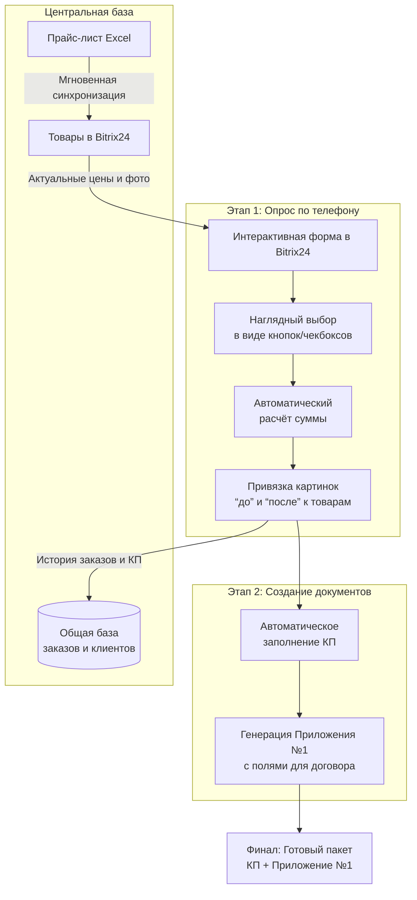

---
tags:
  - сделки
  - стадии
  - продажа
title: Расчёт КП
draft: true
goal: Описание настоящих методов расчёта и включение их в регламент
aliases:
  - '[регламент продажи](ООО%20"Мастер"/регламент%20продажи.md)'
---
# Метод расчёта откосов.  
Составить количество окон и размеры.  
Зная периметр и толщину стен можно посчитать стоимость отделки откосов.  
  
Окно двухстворчато 1300х1400  
До 350 мм ширина - 7000 рублей  
Кирпичка - 10000 рублей.  

Тройнуха  
До 350 мм ширина - 10000 рублей  
Кирпичка - 13-14000 рублей.  

Балконный блок  
Окно двухстворчатое х2 умножаем.  

Если считать в доме предусматриваем скидку 10%

# Метод хранения товаров

Самое первое и необходимое — просто пересмотреть список товаров и настроить вариации на установку остекления, на отделку, написать цены на ремонт и демонтажные работы.

- [ ] Внести в  порядок оплаты. При заказе без монтажа - предоплата минимум 70%

Чтобы создать систему, которая полностью соответствует вашим требованиям к сметам, включая интерактивную опросную форму, прайс-лист и Приложение №1 к договору, можно комбинировать мощный инструмент Bitrix24 и Excel, полностью исключив SGMCode.

Например, интерактивная форма для телефона может выглядеть так, интегрируя смету и договор в одну систему:

### 🔍 Почему SGMCode не подходит под ваши задачи

Программа **SGMCode (WinFastReports Plast 1.6)** — это книга Excel для расчёта окон. Хотя она полезна для базовых операций, её возможности не покрывают ваши ключевые потребности:
*   **Нет интеграции с Bitrix24**: Программа существует отдельно, и данные в неё придётся вводить вручную, что ведёт к тем же проблемам с переключением между приложениями.
*   **Не решает задачу с картинками**: В её описании нет возможности добавлять изображения «до» и «после» для наглядности клиенту.
*   **Не создаёт Приложение к договору**: Программа формирует спецификацию и КП, но не динамический документ с полями «Адрес», «Срок установки», который можно использовать как приложение к договору.

### 💡 Стратегия реализации в Bitrix24 и Excel

Вместо поиска одной программы, предлагаю объединить два мощных инструмента, которыми вы уже пользуетесь.

**1. Создайте централизованный прайс-лист в Excel**
*   **Структура**: Создайте единую таблицу со всеми позициями: окна (с вариациями профиля, стеклопакета), монтаж, демонтаж, отделка, дополнительные услуги. Для каждой позиции укажите артикул, название, свойства и **цену**.
*   **Связь с Bitrix24**: Этот файл станет вашим «единым источником правды». Обновляйте цены только здесь. Для импорта в Bitrix24 используйте встроенную функцию **«Загрузка товаров из файла»** (CSV/Excel). Это позволит массово обновлять цены и свойства товаров в карточках.

**2. Настройте товары и вариации в Bitrix24**
*   **Свойства как в ваших таблицах**: Для товара «Остекление балкона» создайте свойства «Конфигурация» (П-ка, Г-ка), «Размер» (2400x800, 2800x1100…), «Комплектация» (с выносом и фасадом, без отделки и т.д.). Это позволит клиенту выбирать варианты, как вы и планировали.
*   **Картинки к вариациям**: В Bitrix24 можно загрузить отдельное изображение для каждой комбинации свойств. Это решит проблему визуализации «до/после».
*   **Дополнительные услуги как отдельные товары**: Создайте товары в категориях «Тёплый пол», «Отделка», «Шкафы». Их можно будет легко добавлять в смету.

**3. Автоматизируйте создание КП и Приложения №1**
*   **Шаблон КП с динамическими полями**: В настройках CRM Bitrix24 настройте шаблон коммерческого предложения. В него можно вставить поля из карточки сделки, которые будут заполняться автоматически: `{Адрес объекта}`, `{Контактное лицо}`, `{Телефон}`, `{Срок установки}`.
*   **Генерация Приложения №1**: Это тот же шаблон КП, но оформленный как приложение к договору. В Bitrix24 можно создать несколько шаблонов документов. Настройте один специально под «Приложение №1», включив в него все обязательные юридические и технические параметры.

**4. Рассмотрите готовые отраслевые решения**
Для ускорения настройки можно установить готовое отраслевое приложение из Маркетплейса Bitrix24, например, **«Готовая CRM: Производство и продажа окон»**. В нём уже предустановлены воронки продаж, поля для замеров и монтажа, что может стать хорошей основой.

### 🛠 Пример настройки опросного листа
Вот как можно быстро собрать смету во время звонка, используя форму в Bitrix24:

| Шаг в сценарии звонка | Инструмент в Bitrix24 | Что видит менеджер/клиент |
| :--- | :--- | :--- |
| **1. Сбор данных об объекте** | **CRM-форма в сделке** с полями: Тип объекта (балкон/лоджия), Размер, Тип дома, Пожелания. | Заполняет выпадающие списки и поля. Данные сразу сохраняются в карточку. |
| **2. Подбор конструкций** | **Каталог товаров** с фильтрами по свойствам (профиль, стеклопакет). К каждому товару привязаны изображения и варианты. | Выбирает нужные варианты, видит картинку и цену. Товар добавляется в сделку. |
| **3. Добавление работ и доп. услуг** | **Раздел «Товары» в сделке**. Можно добавить услуги «Монтаж», «Демонтаж», «Утепление откосов» из общего каталога. | Видит общий список выбранного с текущей суммой. Может добавлять/удалять позиции. |
| **4. Формирование документов** | **Действие «Печать»** в сделке → Выбор шаблона «КП» или «Приложение №1». | Система генерирует PDF-документ с подставленными данными клиента, адресом, сроком и итоговой сметой. |

### 📊 Сравнение решений

| Критерий | **Предлагаемое решение (Bitrix24 + Excel)** | **Программа SGMCode** |
| :--- | :--- | :--- |
| **Интеграция в один интерфейс** | Полная. Вся работа ведётся в Bitrix24. | Отсутствует. Работа в отдельном окне Excel. |
| **Изображения «до/после»** | Да, можно прикрепить к товарам и вариациям. | Нет, в описании функционала не указано. |
| **Приложение №1 к договору** | Да, как настраиваемый шаблон документа. | Нет, создаёт только КП и спецификацию. |
| **Каталог доп. услуг** | Да, как отдельные товары с категориями. | Частично, можно добавлять услуги, но без структуры каталога. |
| **Актуальность прайса** | Высокая. Единый файл Excel синхронизируется с товарами. | Средняя. Прайс обновляется внутри программы. |

Чтобы двигаться дальше, ключевой шаг — определиться со структурой единого прайс-листа в Excel. Вам нужна помощь в проработке столбцов и формата этого файла, чтобы он корректно загружался в Bitrix24 и покрывал все ваши услуги от остекления до отделки?

