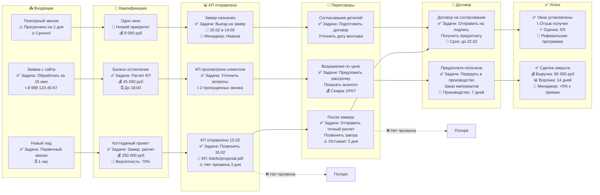

Квалификация  — это ключ к тому, чтобы не тратить время на нереальные сделки, а сосредоточиться на тех, кто действительно готов купить. В бизнесе по остеклению балконов важно оценивать не только интерес, но и готовность к покупке. Вот  критерии, которые помогут отбирать качественные лиды:  
  
  **1. **Наличие объекта****  
  
_Лид должен точно указать, что хочет остеклить — балкон, лоджию, дом
🔹 _Пример хорошего лида:_  «Хочу остеклить лоджию 3,5х1,8 м в 5-этажке, 12-квартира, дом на ул. Ленина».
🔹 _Пример слабого лида:_  «Мне нужно остекление балкона» — без размеров, адреса, типа объекта.

👉 **Что уточнить:**  
- Какой тип конструкции? (балкон или лоджия?)  
- Размеры? (длина, ширина, высота)  
- Этаж, тип дома? (панельный, кирпичный, новостройка?)  
  
**2. **Готовность к покупке (не просто «посмотреть»)****  

_Лид должен говорить о цене, сроках, оплате — не только о «интересе»._

🔹 _Хороший признак:_  «Сколько будет стоить остекление алюминием с двойным стеклом? Где можно посмотреть образцы?»
🔹 _Слабый признак:_  «Может, когда-нибудь...» или «Пока не решил».
  
👉 **Что уточнить:**  
- Когда планируете делать остекление? (сейчас, через месяц, через полгода?)  
- Есть ли бюджет? («до 50 тыс.», «не больше 80 тыс.»)  
  
**3. **Собственность или право на проведение работ****  

_Если человек не собственник — он может не иметь права менять окна._

🔹 _Важно:_  
- Уточнить, кто живёт в квартире: собственник, арендатор, родственник?  
- Если не собственник — возможно, нужно согласование с управляющей компанией.  
  
👉 **Что уточнить:**  
- Вы собственник квартиры?  
- Были ли уже согласования с УК по поводу остекления?  
  
**4. **Сравнение с конкурентами (признак серьёзного интереса)****  

_Если лид уже посмотрел у других, это хороший знак — он в процессе выбора._
🔹 _Хороший признак:_  «Увидел у компании Х — цена 45 тыс., но у вас дешевле?»
🔹 _Слабый признак:_  «Просто посмотрел в интернете» — без сравнений.

  👉 **Что уточнить:**  
- Уже обращались к другим компаниям?  
- Что понравилось/не понравилось у них?  
  
**5. **Контактная доступность и оперативность****  

_Лид должен отвечать на звонки/сообщения и не «исчезать»._

🔹 _Хороший признак:_  Отвечает в течение 24 часов, согласен на замер, приходит на встречу.
🔹 _Слабый признак:_  Не отвечает 3 дня, не приходит на замер, не звонит обратно.

  
👉 **Что делать:**  
- Установите правило: если лид не отвечает 2 дня — отправьте напоминание.  
- Если 3 попытки связи без ответа — помечайте как «неактивный».  
  
  
**💡 **Бонус: Как использовать это в Bitrix24?****  
1. Создайте **внутренний статус лида** — например:  
- «Новый» → «Квалифицирован» → «Замер назначен» → «Предложение отправлено» → «Закрыто»  
2. Добавьте **поля формы** для сбора этих критериев:  
- Тип объекта (балкон/лоджия)  
- Размеры  
- Планируемая дата  
- Бюджет  
- Собственник? (Да/Нет)  
3. Настройте **автоматические напоминания** через 1 и 3 дня после контакта.  
  
  
Если вы хотите, я могу помочь вам составить **шаблон вопросов для звонка** или **форму на сайте**, чтобы автоматически собирать эти данные — просто скажите! 😊

Должна помочь ответить на серию вопросов и заполнить соответствующие поля:
которые заполняются при квалификации или выявлении потребности. Это должно быть поле типа "множественный список" (где можно выбирать несколько значений):
Значение(я) этого списка должно отвечать на вопрос, который содержится в договоре п.  1.1. Исполнитель на основании задания Заказчика обязуется передать в собственность Заказчика светопрозрачные конструкции из профилей ПВХ и/или алюминиевых профилей Al, стеклопакеты, комплектующие части, материалы, фурнитуру (далее - «Товары» или «Изделия») и/или выполнить работы по их доставке и/или монтажу (далее - «Работы» или «Монтаж), а Заказчик обязуется принять и оплатить Товары и Работы в соответствии с Договором.