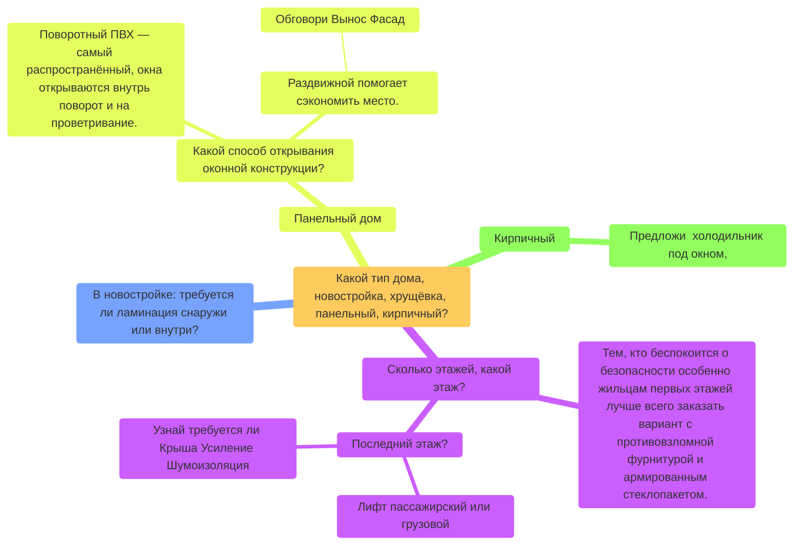
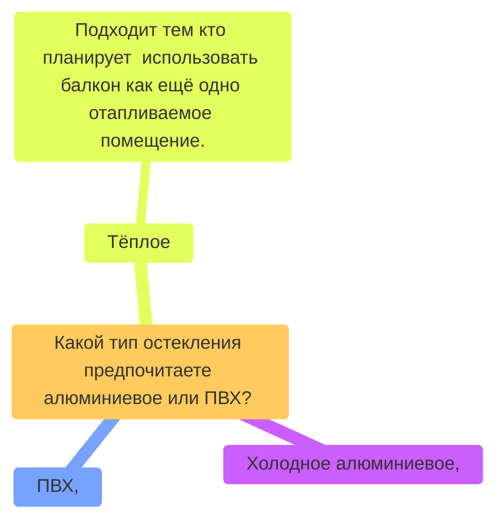
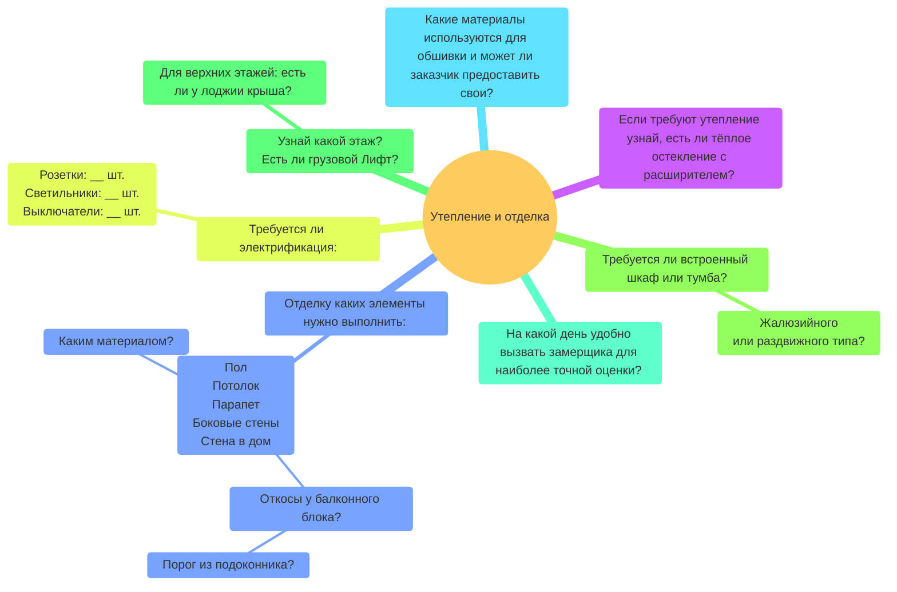
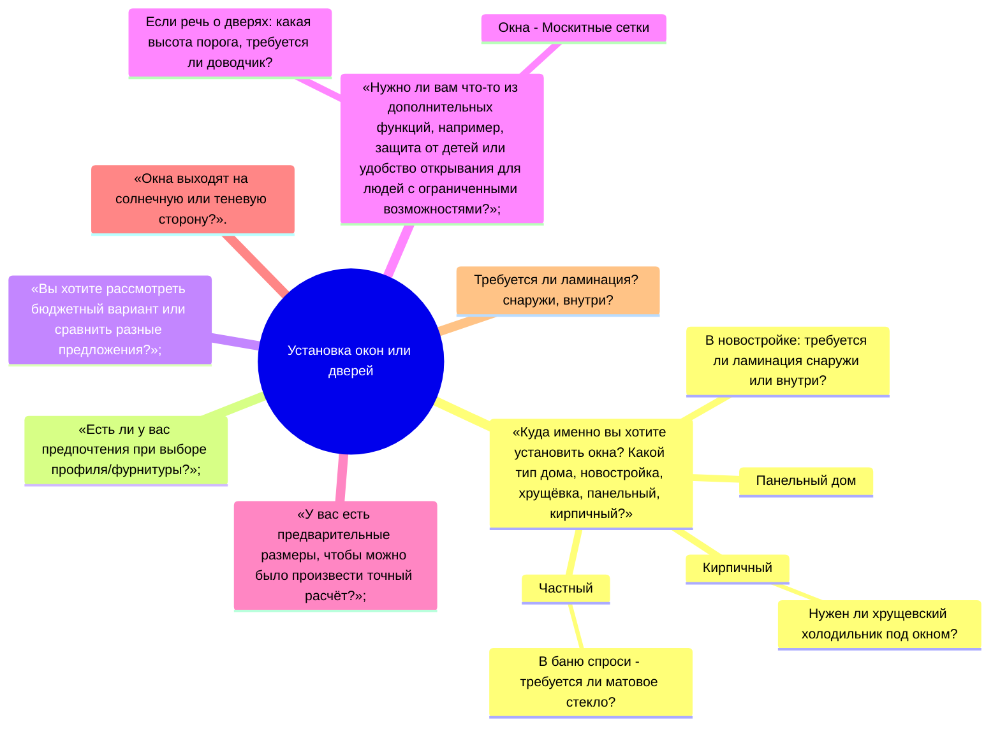

# Шаблон вопросов для звонка
[tatoos](tatoos.md)
[Вячеслав](https://master-groups.bitrix24.ru/crm/contact/details/76292/) +7 982 737-98-46
Фактический адрес: Екатеринбург
Комментарий
Поменять окна на кухне и балконный блок.  
Адрес объекта
Екатеринб, ул. Советская д.9 кв.70
Дата и время замера
18.01.2026 11:00:00

Конечно! Вот пример шаблона вопросов для звонка, который поможет вам квалифицировать лид в бизнесе по остеклению балконов. Он включает ключевые пункты, которые вы уже обсуждали ранее:  
  
  
**📞 Шаблон вопросов для звонка (остекление балконов)**  
  
**1. Приветствие и подтверждение интереса:**  
- Здравствуйте, меня зовут [Ваше имя], мы с вами связались по поводу остекления балконов. Вы всё ещё рассматриваете этот вопрос?  
  
**2. Уточнение объекта:**  
- Можете, пожалуйста, уточнить, что именно вы хотите остеклить — балкон, лоджию или оба?  
- Каковы примерные размеры? (длина, ширина, высота)  
- На каком этаже находится квартира? Какой тип дома? (панельный, кирпичный, новостройка)  
  
**3. Готовность к покупке:**  
- Когда вы планируете провести остекление? (сейчас, через месяц, через полгода?)  
- Есть ли у вас ориентировочный бюджет? (например, до 50 тыс. руб.)  
  
**4. Право на проведение работ:**  
- Вы являетесь собственником квартиры?  
- Были ли уже согласования с управляющей компанией по поводу остекления?  
  
**5. Сравнение с конкурентами:**  
- Уже обращались к другим компаниям?  
- Что именно вас интересует в остеклении? (цена, материалы, сроки, гарантия)  
  
**6. Контактная доступность:**  
- Можете ли вы ответить на звонки или сообщения в течение 1–2 дней?  
- Хотите ли вы, чтобы наш специалист выехал на замер в ближайшие дни?  
  
  
**📌 Дополнительно:**  
- Если клиент отвечает не сразу или не до конца, вы можете мягко напомнить:  
_«Мы хотим максимально точно рассчитать стоимость и сроки, поэтому важно собрать немного информации. Не могли бы вы уточнить...»_  
  
  
Если вы хотите, я могу адаптировать этот шаблон под вашу конкретную ситуацию или настроить его в Bitrix24 как часть автоматического сценария обработки лидов. Скажите, что вам удобнее! 😊
# Остекление балкона или лоджии

# Обязательные
Примерный размер проёма: ширина, высота?
Тип парапета: бетон железо?
Предложить добор.

# Часто задаваемые
	Как можно узнать точную стоимость работ? 
        Все заказы разные, точную стоимость скажут только по результатам замера.
    Какие сроки гарантий на работы и материалы? 
        2 года на работу и материалы.
	Источники
		https://balkonplus.ru/stati/faq-voprosy-zakazchikov
		https://dzen.ru/a/YAP68f1i7gaJVp_
  
# Утепление и отделка

# Установка окон и дверей

! Чтобы дать понять клиенту, что его услышали, можно повторить ключевые мысли и слова в разговоре. Также важно уточнить, что входит в конечную стоимость заказа: доставка, монтаж, подъём конструкций на нужный этаж, демонтаж старых рам и т. д.

# Поля в CRM
	Система прфилей 
    фурнитура 
    Цвет снаружи
    моск,сетки бел.
    отливы
    Падок. (белый)
    (пластик. отделка снаружи всегда 1.дета
    профиля с этой стороны)
    Стеклопакеты с рамкой Mlt(cep)
    фед , уплотнение
    Цвет изнутри (белый)

Клиент часто толком не знает, какое окно ему нужно, но хочет сэкономить. Задача менеджера в этом случае — перевести диалог в сторону решения проблемы. 

**Узнай:**  Материал стен, Тип дома,  
Требуется ли ламинация, утепление откосов, расширение проёма  
Подоконник для порожка 
**Окно: Профиль Толщина Цвет**  
**Стеклопакет МФ-покрытие, И стекло**  
**Москитная сетка**  
**Детский** замок  
Этаж Лифт
## Сразу начните обсуждать задачу

Не правильно ❌
> — Мне нужно обычное окно 120х150 см.  
> — Такое у нас стоит тысяч с доставкой и монтажом.  
> — Спасибо, я позже позвоню/зайду.  
  
Правильно ✔ 
> — Скажите, а сколько стоит у вас стандартное окно?  
> — Добрый день! Я сейчас вас сориентирую по цене. А как я могу к вам обращаться?  
> — Валентина.  
> — Очень ПРИЯТНО. Валентина, Меня зовут Сергей. У нас цена на стандартное окно средняя по рынку, примерно 20 000 тысяч рублей. Валентина, а вы по какой причине решили окно поменять? У вас сейчас стоит пластиковое или деревянное?  
  
Не правильно ❌  
— Мне нужно простое окно в панельный дом.  
— А у нас как раз сейчас скидка на окна  
с мультифункциональным стеклопакетом.  
— Мне нужно обычное, с простым стеклом.  
— Хорошо. А не хотите цветной профиль?  
Это красиво.  
  
Правильно ✔  
— Мне нужно обычное окно.  
— У нас есть разные модели. Какое окно в вашем представлении обычное? Что для вас важно в остеклении?  
— чтобы не потело и не продувало,  
— Продувает окно. если оно неправильно установлено или не отрегулирована фурнитура. У нас работают опытные монтажники, а используем только немецкую фурнитуру SlEGENIA. Так что продуваний точно не будет. А запотевание — это обычно проблема с вентиляцией, У вас широкие подоконники? Если да — то нужны будут вентиляционные отверстия, чтобы теплый воздух попадал на окно.  
  
**Выясните потребности клиента и предложите подходящие решения**

Не правильно ❌
— У нас есть модели с повышенной защитой от взлома — в них установлена специальная фурнитура и бронированные стекла.  
— Да зачем мне это. квартира-то на четвертом этаже.. |  
  
Правильно ✔  
— Позвольте я еще один вопрос задам.  
Вы на каком этаже живете?  
— На четвертом. А это важно?  
— Ну, вы же моете окна?  
— Два раза в год мою обязательно.  
— Когда одна часть в окне глухая. ее сложно мыть, Давайте посчитаем две открывающиеся створки? можно будет помыть обе створки, не высовываясь на улицу. Это получается на 5000 рублей дороже, но удобнее и безопаснее.  
Добавляем?  
  
**Не торопитесь рассказывать про все преимущества сразу**

Если заказчику приходится перебивать менеджера — он может подумать, что продавец его пытается «заговорить».

Не правильно ❌  
— Я еще хотела самый широкий подоконник, чтобы у дочки там было место  
для мягких игрушек.  
— Отлично. Максимальная ширина подоконника у нас — 80 см. Если у вас  
стандартные откосы 45 см, то нужно будет установить упоры. чтобы он не прогибался. Такая работа будет стоить...  
— Да подождите! Я имела в виду как раз 45-50 см, не знала, что бывают шире... 
  
Правильно ✔  
— Я еще хотела самый широкий подоконник, чтобы у дочки там было место  
для мягких игрушек.  
— Отлично. У вас же панельный дом? Значит откосы стандартные. 45 см. можем увеличить подоконник до 50-55 см без упоров. Такой ширины хватит?  
— Да, должно хватить. А сколько это будет стоить?  
 
Не ругайте конкурентов и говорите о преимуществах. Вместо этого лучше сделать акцент на преимуществах вашей компании.

Не правильно ❌  
— Мне в фирме ХХХ такое же окно посчитали дешевле.  
— знаю я эту фирму — они все самое дешевое используют, клиенты постоянно жалуются.  
— Странно. они то же самое про вас говорили...  
  
Правильно ✔  
— Мне в фирме ХХХ такое же окно посчитали дешевле.  
— А вы уточняли. входит ли в стоимость монтаж, подоконники? Какую фурнитуру внесли в расчет? Мы производим окна с немецкой фурнитурой SlEGENIA. Вам же важно. чтобы окно не сломалось через 10-15  
лет?

Проявляйте заботу и помогайте заказчику сэкономить
Клиент обычно не разбирается в конструкции и параметрах остекления, поэтому может предлагать ненужные опции. 

Не правильно ❌  
— Я хочу установить ударопрочное стекло, чтобы трудно было разбить,  
— да, конечно, вношу в заказ.  
  
Правильно ✔  
— Я хочу установить ударопрочное стекло, чтобы трудно было разбить.  
— Это для защиты от взлома?  
— Да, я живу на первом этаже,  
— На самом деле один лишь ударопрочный стеклопакет никак вам не поможет — взломщик может просто вскрыть створку. Взломостойкое окно — это комплекс мер. Тут понадобится противовзломная фурнитура, ударопрочное стекло, специальный профиль, усиленный крепеж. Такое окно тяжелее обычного. поэтому еще нужны будут петли для повышенной нагрузки.  
— А сколько будет все вместе стоить?  

Если построить диалог правильно — будет проще найти общий язык с клиентом. Когда менеджер выясняет, что на самом деле нужно заказчику, и предлагает решения — он не навязывает окна подороже. 

[Профессия "Продавец-консультант"](https://sites.google.com/site/professijaprodaveckonsultant/о-сайте)

- [о сайте](https://sites.google.com/site/professijaprodaveckonsultant/о-сайте)
    
- [10 правил увеличения объемов продаж](https://sites.google.com/site/professijaprodaveckonsultant/10-правил-увеличения-объемов-продаж "10 правил увеличения объемов продаж")
    
- [Summary - краткое содержание популярных бизнес-книг](https://sites.google.com/site/professijaprodaveckonsultant/summary-краткое-содержание-популярных-бизнес-книг "Summary - краткое содержание популярных бизнес-книг")
    

- Дополнительно
    
Ds44tj@kKi - srs
GXuQ7CDr - конс
#продажа 

В этой публикации постараемся максимально описать алгоритм продаж, который позволит Вашим менеджерам и, соответственно, вашей компании быть более эффективной.

_**Установление контакта**_

1. Следует поднимать трубку после 2–3 звонков.

2. К примеру, необходима следующая фраза: "Компания "Супер-Окна". Здравствуйте".

3. Поинтересоваться, как зовут клиента.

С самого начала беседы многие менеджеры обычно начинают спорить и приводить "свои" аргументы, не поинтересовавшись именем своего собеседника. И тут следует заметить, что в Европе такого пункта в тренингах продаж не существует. Спросите: "Почему?". Ответ прост: немцы с пеленок знают, что беседа между людьми может проходить только когда собеседники знают имя друг друга. Возможно, в нашей стране это не нужно? Тогда почему мы так завидуем благополучной и сытой Европе?

Итак, в начале беседы необходимо обязательно спросить (и запомнить!) имя клиента, чтобы употреблять его на протяжении всего диалога. Однако имя собеседника мы спрашиваем только после того, как представились сами. Разговор может выглядеть приблизительно так:

Менеджер: "Вы позвонили в компанию "Супер-Окна", здравствуйте!"

Клиент: "Здравствуйте, рассчитайте, пожалуйста, стоимость окна" или: "Сколько стоят ваши окна?"

Менеджер: "Я охотно сейчас рассчитаю их стоимость. У нас большой ассортимент, поэтому давайте сначала разберемся, какие именно окна вам нужны. Меня зовут Ирина, а как лучше обращаться к вам?"

Уход от вопроса цены. Это очень тонкий момент в продажах, и часто менеджеры подвержены тому, что идут на поводу у клиента, т.е. делают то, что он просит. Безусловно, желания клиента должны быть в центре внимания, но прочтите еще раз пример диалога, расположенного выше. Менеджер очень грамотно уходит от озвучивания цены, потому что понимает – **цену клиенту необходимо называть только после того как он понял, за что заплатит свои деньги**.

_**Выявление потребностей**_

Будет правильным, если после этапа установления контакта менеджер определит потребности или проблемы клиента. Многие менеджеры упускают данный этап, т.к. не видят в нем необходимости. Это еще называется неосознанной некомпетентностью, иными словами, – "я не знаю того, чего я не знаю".

К анализу этапа выявления потребностей мы относим:

1. Правильные вопросы – это все вопросы, которые дают возможность заставить клиента разговориться, помочь ему рассказать о своих проблемах: "Не могу определиться, какие окна лучше", "Хочу окна, как у соседа", "Делаю ремонт дома", "Столько компаний, и все рассказывают одно и то же".

2. Активное выслушивание.

Научиться внимательно слушать и слышать – актуальная проблема нашего общества. Многие, к сожалению, этому еще не научились – исследовав работу десятков оконных компаний, мы убедились именно в таком неутешительном результате. Так, например, на часто задаваемый клиентами вопрос: "А чем ваша компания лучше?", менеджер отвечает: "А давайте я вам рассчитаю окна".

Управление процессом продаж – к сожалению, пока еще мало понятное для "современного" продавца понятие. Оно означает, что не менеджер отвечает на вопросы клиента – менеджер управляет беседой, задавая клиенту правильные, заранее подготовленные вопросы и показывая свою заинтересованность, ведь только с помощью логично выстроенных вопросов можно разобраться в том, какие аргументы менеджеру следует приводить далее. А еще необходимо проявлять великодушие к клиенту.

_**Презентация**_

К сожалению, многие менеджеры считают, что чем больше они расскажут клиенту об окне, тем быстрее смогут его уговорить совершить покупку. Однако общеизвестная истина гласит: кто много говорит – наводит скуку. Естественно, многое зависит от того, что именно мы будем говорить клиенту. Необходимо вести доступный рассказ на языке пользы и выгоды, а не говорить, что у окон серое уплотнение, пять камер и фурнитура со специальным покрытием – ведь все равно клиент, скорее всего, ничего в этом не поймет, а если и постарается понять, то это будет его неправильной интерпретацией. Важно дать понять клиенту, какую пользу для него принесет то или иное преимущество окна. Например, серое уплотнение сделает окна более элегантными и по-европейски современными, а также визуально увеличит световой проем за счет отсутствия черной рамки. Клиент сэкономит еще на замене уплотнений, так как срок службы серых уплотнителей, в отличие от черных, составляет 30 лет, а благодаря инновационному компонентному составу их форма и цвет сохранятся на долгие годы.

Таким образом, на презентации менеджеру необходимо:

1. Суметь убедительно рассказать о выгодах, которые клиент получит от продукта.

2. Давать клиенту советы на уровне эксперта.

3. Уметь определять основные потребности клиента, а не вести беседу обо всем, что менеджер знает, но только не о том, что реально беспокоит клиента.

4. Грамотно информировать клиента о программах скидок. На вопрос клиента о скидках нам приходилось неоднократно быть свидетелями следующих высказываний менеджеров: "А скидку я вам уже посчитала. 25%"

5. Грамотно объяснять цену товара, однако не в коем случае не называть ее без аргументации.

_**Работа с возражениями**_

При обследовании этапа работы с возражениями оказалось, что в этом менеджеры наиболее профессионально подготовлены. Однако следует заметить, что менеджеры-профессионалы, как правило, обходятся без возражений.

На этапе работы с возражениями очень важны:

1. Манера общения менеджера.

2. Наличие возражений.

3. Применение техники работы с возражениями.

На теме работы с возражениями мы очень подробно останавливаемся в ходе наших семинаров, где менеджеры отрабатывают технику работы с такими типичными высказываниями клиентов, как, например: "Очень дорого", "В соседней компании дешевле", "Пойду посоветуюсь с мужем" и т.д.

_**Завершение беседы**_

_Вариант 1_

_Клиент: "…Ну, ладно, я тогда еще подумаю"._

_Менеджер: "Хорошо, подумаете – позвоните"._

_Клиент: "До свиданья"._

_Менеджер: "До свиданья"._

**Вариант 2**

Клиент: "…Хорошо, я тогда еще подумаю".

Менеджер: "Марья Петровна, я очень хорошо понимаю, что для вас покупка окна – это очень серьезное решение. Видимо, вас что-то смущает?"

Клиент: "Если честно, то мне просто надо с мужем посоветоваться".

Менеджер: "Я тоже всегда советуюсь с мужем, а как вы думаете, что будет для вашего мужа самым важным при выборе окна?"

Клиент: "Уверена, он очень переживает, чтобы нас не обманули, ведь столько вокруг компаний-однодневок…"

Менеджер: "Марья Петровна, я вас очень хорошо понимаю, и действительно, сегодня множество наших клиентов опасаются именно этого. Поэтому нужно обращать внимание на то, есть ли в компании собственное производство, сколько она существует на рынке, с какими поставщиками работает, есть ли у нее рекомендации, а также крупные застекленные объекты. И еще: очень важно увидеть, как работают сотрудники. В их профессионализме можно убедиться, посетив офис, где вам предложат рассчитать окно или вызвать мастера по замерам".

Клиент: "Поняла, большое спасибо за совет. Буду думать" (мы разговорили клиента, но он не уходит и продолжает настаивать на своем).

Менеджер: "Я могу дать вам еще один совет. Вы значительно сэкономите свое время, если сразу вызовите нашего мастера по замерам. Это вас ни к чему не обяжет, но он вам на месте сможет дать еще лучшие советы, а также проконсультировать и вашего мужа".

После конкретного определения даты и времени посещения технического специалиста менеджер обязан еще раз вслух повторить и даже записать на бумаге оговоренные сроки проведения замера и передать ее клиенту (это поможет клиенту не забыть время замера и осознать всю важность данного этапа работы). И только после этого менеджер может вежливо попрощаться с клиентом.

Очевидно, многие руководители, прочитав эти строки, тяжело вздохнули, ведь до такого уровня обслуживания нам еще очень далеко…

Этот пример имеет непосредственное отношение и к предыдущему этапу – работе с возражениями (менеджер рассеивает все оставшиеся у клиента сомнения).

Однако, возвращаясь к теме завершения беседы, необходимо подчеркнуть, что на этом этапе очень важно:

1. Уточнить контакты.

2. Взять на себя обязательства.

3. Вежливо попрощаться.

_Этикет делового общения_

Проводя исследования, мы часто сталкивались со странным явлением: несмотря на то что менеджеры практически «на отлично» проводили беседы с нами, у нас все же складывались неприятные впечатления от услышанного. Проанализировав причины их возникновения, мы смогли определить еще одно необходимое условие работы при продажах окон – этикет делового общения менеджеров. Оно включает:

1. Клиентоориентированность при разговоре.

2. Предоставление информации о конкурентах.

При этом необходимо придерживаться правила: эксперт не говорит о конкурентах плохо. На вопрос: "А чем ваши окна лучше, по сравнению с окнами компании N?" – ответ менеджера должен быть следующего характера: "Это тоже хорошие окна. А почему вас интересует именно эта система?"

3. Четкая формулировка мыслей.

4. Поведение во время разговора: приветливое и заинтересованное общение, а не грубое и пассивное.

5. Следует обязательно обращаться к клиенту по имени.

6. Необходимо уточнить источник информации о вашей компании.

Ирина Антипина, "Бизнес-Креатив" первая консалтинговая компания для оконного рынка

#продажа Узнай дополнительно:  
Является ли собственником, юридическим лицом?  
Какой бюджет закладывает?  
В каком городе, дальность доставки, Этаж Лифт  
Когда планирует установку?  
Является ли пенсионером или инвалидом?

Подтверждай клиенту, *словами что ты понимаешь суть его запроса*, это покажет твою внимательность и заинтересованность.  
  
Подчеркни, что **предлагаешь клиенту товар или услугу, исходя из его потребностей.** Объясняй информацию о продуктах или услугах ясно и доступно, избегая сложных терминов, жаргона и нецензурной лексики.

В завершении разговора подчеркни, какие **преимущества и ценность** получит клиент от твоего предложения, и объясни, *как твой продукт или услуга решает его проблему*.

>_Вы получите современную технологичную пластиковую конструкцию с качественным монтажом, с которым вы забудете о промерзании. На заводе Века высокая культура производства. Премиальные материалы впишутся в любой интерьер. Красивый вид и современные технологии. Надёжная фурнитура, которая будет служить долгие годы._  
  
Будь готов ****ответить**** на ****любые вопросы**** клиента. Если не знаешь ответа, честно ****признайся и пообещай уточнить**** информацию. Это поможет сохранить доверие.

>_ПВХ остекление собрано таким образом что рамы по ширине меньше чем дерево, но теплосопротивление лучше за счёт подгонки материалов._

Подведи ****итог разговора**** и предложи ****следующий шаг****, [cопровождение сделки](Сопровождение%[20сделки.md](https://20сделки.md)) будь то оформление заказа или отправка дополнительной информации

Вы должны понимать, за счёт чего мы экономим. Если вам предлагают дешевые окна и дешевый монтаж, то скорее всего там никакой гарантии. Мы устанавливаем только качественные окна Века с гарантией на конструкции 24 месяцев и гарантией на монтажные работы 24 месяца.

Roto — надёжная фурнитура, которая никогда не подводит. Даже на окна отечественных производителей мы устанавливаем немецкую фурнитуру Roto, потому, что фурнитура выполняет самую важную функцию в не глухом окне — открывание, закрывание, микропроветривание. Даём гарантию на регулировку.  
  
Сделай презентацию с примерами наших работ и договорись созвониться позже, определи срок. Расскажи, ****как клиент сможет добраться в вашу компанию****, если это актуально, и как он сможет связаться с вами, если у него возникнут вопросы.  
  
Заверши разговор, поблагодарив клиента за уделенное время и интерес к вашей компании. Значит нам по пути. Это оставит положительное впечатление и укрепит отношения с клиентом.

продажа 

После того как узнал какую задачу планирует решить клиент, уточни:
  
Если требуется установка окон или дверей **в своём доме** узнай:  
Требуется ли ламинация?  Тип дома, из чего сделаны стены. Обычно заказывают монтаж окон без отделки.
Если свой дом узнай чем планируют отапливать, предложи "И" - стекло.  

**Узнай дополнительно** 
Является ли собственником?  
Какой бюджет закладывает?  
В каком городе, дальность доставки, 
Когда планирует преступить установке?  

| Название поля | Тип данных |
| ------------- | ---------- |
| Адрес объекта | адрес      |

**Если в общем доме**
Материал стен: панель кирпич?
чтобы учесть при расчёте глубину проёма и посчитать подоконник и откосы. Поинтересуйся, если окна выходят на 
солнечную сторону предложи пакет с МФ-покрытием, 
Москитная сетка  Детский замок  

| Название поля     | Тип данных |
| ----------------- | ---------- |
| Вид дома          | файл       |
| Солнечная сторона | да\нет     |

На замере предложи утепление откосов. Если нужно Расширение проёма? Куда, насколько?

> В товаре "Монтаж окна"
> Утепление откоса да/нет

Профиль Толщина Цвет  - вещи второстепенные при телефонной продаже. Это всё можно посмотреть в офисе.

Если требуется ****Остекление балкона/лоджии**** узнай:  
Планирует ли отапливаемое помещение?  Предложи выбрать
тип остекления: холодное алюминиевое / ПВХ или тёплое.  Теплое считаем если требуется отапливаемое помещение.
Если дом новый, узнай: требуется ли ламинация (цвет) снаружи, внутри?  
На замере определи размер проёма, тип парапета (бетон, железо), спроси требуется ли вынос, в каких направлениях? Если нужна Крыша - предложи Усиление от снега зимой, предложи Шумоизоляция козырька. 
отметь этаж и лифт, чтобы не забыть про стоимость подъёма, труд должен оплачиваться.
  
Если требуется **Утепление** лоджии спроси тёплое ли остекление, установлен ли расширитель?  
Если новостройка и стены утеплены минватой - нужно считать расширитель.
Какие элементы хотят утеплить 
Пол Потолок Парапет Боковые стены Стена в дом с откосами Требуется ли Электрификация: Розетки Светильники Выключатели: _________ шт.  
Подоконник для порожка да/нет  
Узнай этаж и лифт.  Если грузового лифта нет - предупреди что подъём на этаж оплачивается.
Предложи, встроенный шкаф или тумбу или холодильник под окном 🤔,  
Запиши Этаж есть ли Лифт ?
  
****Скидки****  
Определить возможность скидки является ли пенсионером.

Подтверждай клиенту, ****словами что ты понимаешь суть его запроса****, это покажет твою внимательность и заинтересованность.  
  
Подчеркни, что ****предлагаешь клиенту товар или услугу, исходя из его потребностей.**** Объясняй информацию о продуктах или услугах ясно и доступно, избегая сложных терминов, жаргона и нецензурной лексики.

В завершении разговора, если вам по пути, подчеркни, какие ****преимущества и ценность**** получит клиент от твоего предложения, и объясни, **как твой продукт или услуга решает его проблему**.

Вы получите современную технологичную пластиковую конструкцию с качественным монтажом, с которым вы забудете о промерзании.

Премиальные материалы. Впишется в любой интерьер. Красивый вид и современные технологии. Вы получите качественную фурнитуру, которая позволяет открывать окно и будет служить долгие годы, радовать вас надёжностью.
  
Будь готов ****ответить**** на ****любые вопросы**** клиента. Если не знаешь ответа, честно ****признайся и пообещай уточнить**** информацию. Это поможет сохранить доверие.

ПВХ остекление собрано таким образом что рамы по ширине меньше чем дерево, но теплосопротивление лучше за счёт подгонки материалов.

Подведи ****итог разговора**** и предложи ****следующий шаг****, будь то оформление заказа или отправка дополнительной информации  
  
Сделай презентацию с примерами наших работ и договорись созвониться позже, определи срок. Расскажи, ****как клиент сможет добраться в вашу компанию****, если это актуально, и как он сможет связаться с вами, если у него возникнут вопросы.  
  
Заверши разговор, поблагодарив клиента за уделенное время и интерес к вашей компании. Это оставит положительное впечатление и укрепит отношения с клиентом.