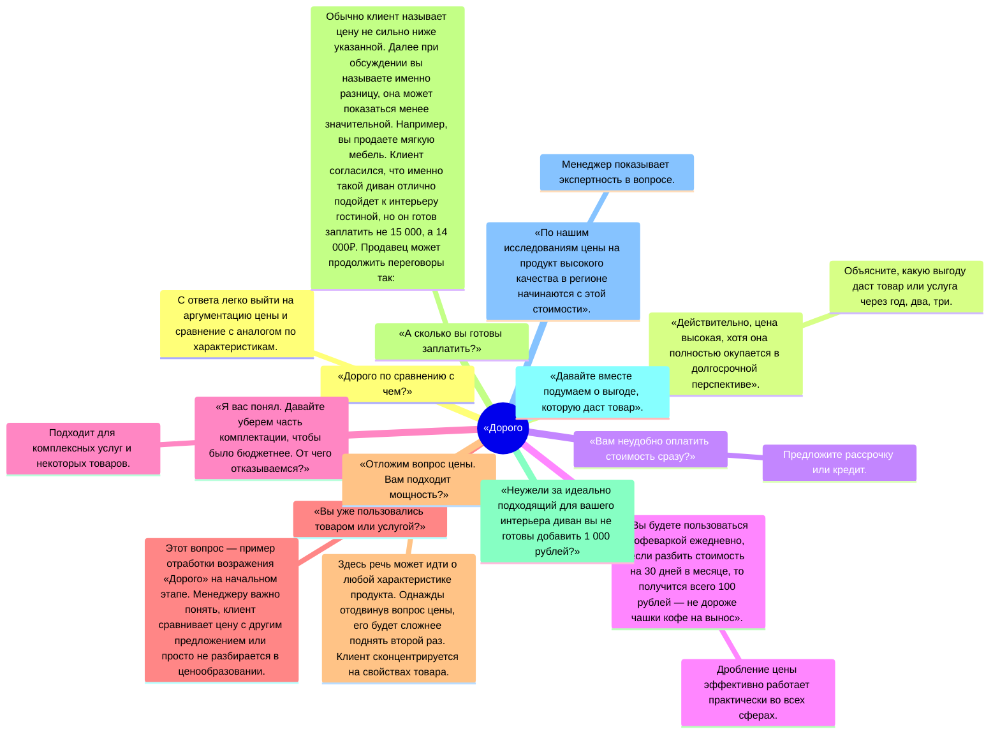

Основные возражения:
- дорого
- я подумаю
- 
# Дорого
Самое распространенное сомнение покупателя — цена товара, она кажется завышенной. Многие продавцы не знают, как отработать возражение «Дорого» в продажах, соглашаются с клиентом либо спорят с ним. Это отталкивает покупателя, он уходит без покупки и с неприятным впечатлением от общения. Основной рабочий вариант ответа в продажах на возражение «Дорого» — **обоснование стоимости продукции**. И опытные продажники знают: если покупатель не готов потратить указанную сумму сразу, на этом не заканчиваются переговоры. Сомнение в цене — только этап, через который проходят практически все покупатели в офлайн-магазинах и онлайн-торговле. В статье расскажем, что отвечать на возражение, если покупатель говорит «Дорого».

## Почему возникает сопротивление по цене

Возражения в процессе переговоров — нормальное явление. Так клиент защищается, он подсознательно считает, что продавец хочет обмануть, залезть в его кошелек. В среднем за одни переговоры возникает до 5 сопротивлений, самое распространенное — по цене. Обычно оно возникает после этапа презентации товара и озвучивания стоимости. 

Важный момент: возражение появляется не только при личных продажах. При построении стратегии интернет-маркетинга тоже важно учитывать сопротивления клиентов, однако они остаются невысказанными. В интернет-маркетинге сопротивления нужно самому прогнозировать и заблаговременно работать над закрытием возражения «Дорого». **Нужно собрать возможные причины появления сопротивления и обработать каждую, например, в статьях, постах или карточке товара. Чтобы формировать гипотезы было легче, можно зафиксировать возражения при личных продажах в CRM-системе, а затем использовать эти данные в интернет-маркетинге.** 

Чтобы решить, как ответить на вопрос «Почему так дорого», необходимо определить причины возникновения возражения. Варианты:

1. **Ценность продукта не соответствует стоимости.** Ценность продукта формирует продавец в ходе презентации. Например, в SMM-маркетинге это могут быть посты о свойствах и выгоде товара. В них важно делать акцент не столько на свойствах товара, сколько на выгоде для покупателя. Если покупатель не понимает, что он получает от товара или услуги, то его ценность недостаточно высока, чтобы заплатить указанную стоимость. Как работать с возражением «Дорого» в данном случае? Проработать более подробную практическую презентацию продукта. Не зацикливайтесь на фичах продукта, большинству клиентов до них нет дела. Расскажите о выгоде, пользе и покажите, как жизнь человека станет лучше после покупки. Также хороший вариант — показать проблему и продемонстрировать, как продукт ее решает.
    
2. **Клиент испытывает потребность сэкономить.** Мягко напомните старую поговорку — скупой платит дважды. Не всегда низкая цена товара позволит сэкономить в долгосрочной перспективе. Один из примеров отработки возражения «Дорого» в продажах — указать на экономию в будущем. Менеджеру нужно объяснить, что купив этот товар сейчас, покупатель будет экономить на протяжении нескольких месяцев или лет. 
    
3. **Уверенность клиента, что он знает о продукции все.** Обычно клиент сравнивает два товара с разной стоимостью по 1–2 характеристикам. При этом упускает множество критериев, которые влияют на цену. Покупатель может выбирать телевизор только по диагонали экрана, но не задумываться о матрице, встроенных функциях или разрешении. Так как бороться с возражением «Дорого» приходится практически всегда, не дожидайтесь, пока покупатель спросит о более бюджетной модели, начинайте сравнение сами, конечно, подчеркивая преимущества дорогого товара. 
    
4. **Клиенту нравится торговаться.** Есть люди, которым это приносит наслаждение. Они с бо́льшим удовольствием купят дороже, но со скидкой, чем дешевле по фиксированной цене. Что делать, если клиент говорит «Дорого» и явно желает выбить скидку? Подарите ему безделушку, дополнительный аксессуар, скидку на следующую покупку. Этого может быть достаточно для удовлетворения желания поторговаться.
    
5. **У потребителя с собой нет денег.** Даже отказ от покупки по уважительной причине не является поводом, чтобы прекратить борьбу с возражением «Дорого». Напомните про возможность кредитования, предложите рассрочку, на крайний случай просто спросите, на какое число назначить звонок менеджера для заключения сделки. 
    

Не всегда причину сопротивления можно понять. Особенно сложно бывает разобраться в причинах при интернет-маркетинге. В таких случаях важно заложить работу с возражением «Почему так дорого» в продажах в презентацию товара. То есть действовать на опережение. 

Кроме причин важно понимать тип сопротивления. Оно может быть истинным и ложным. Истинное строится на логике, часто приходит в связи со сравнением с другим товаром, с желанием получить большую выгоду. Менеджеру нужно понимать, как обработать возражение «Дорого», и хорошо разбираться в характеристиках товара. 

Ложное сопротивление импульсивно, направлено скорее не на продукцию и его стоимость, а на менеджера. Продавцу нужно отталкиваться от реакции покупателя и постараться отыскать истинные причины отказа. 

Правильная обработка истинного возражения обычно приводит к покупке. А работа с ложным сопротивлением приводит к выявлению настоящих проблем. 

Попробуйте инструменты для эффективных продаж бесплатно в течение 14 дней на максимальном тарифе

[Начать бесплатно](https://my.aspro.cloud/register/acloud?utm_content=https%3A%2F%2Faspro.cloud%2Fcrm%2Fdocs%2Fzavershenie-sdelki%2F&referer=https%3A%2F%2Fyandex.ru%2F&utm_referrer=https%3A%2F%2Fyandex.ru%2F)

## Как ответить на возражение клиента «Дорого»: правила работы

Каждая ситуация, которая может возникнуть в ходе переговоров, уникальная. Это зависит от специфики продукта и покупателя. Не всегда получается подготовить скрипт что ответить на возражение, если клиент говорит у вас слишком дорого. Но можно взять на вооружение несколько простых правил, которые уместны в любой ситуации, и закрепить их в регламенте для отдела продаж. 

Регламент отдела продаж
Получите шаблон регламента отдела продаж, чтобы создать на его основе свой. Получить. Нажимая кнопку, вы соглашаетесь на обработку персональных  
данных и с публичной офертой

### Правило №1: Аргументируйте стоимость продукта

Покупатель стремится не к дешевизне, а к адекватной цене. Он не хочет переплачивать. Если продукт имеет более высокую стоимость, чем аналог у конкурента, объясните, чем он отличается, почему дороже. Когда закончите презентацию, подведите к тому, что среди аналогов с этим набором характеристик ваш товар имеет приемлемую цену. 

### Правило №2: Используйте формулы ДПУ и ПСО

Две простые маркетинговые формулы дают универсальный алгоритм, как отвечать на возражение покупателя «Дорого». 

Алгоритм ДПУ:

1. **Думал.** Сперва я думал, что цена слишком высокая.
    
2. **Попробовал.** Но я решил попробовать и не пожалел. 
    
3. **Убедился.** Я убедился, что товар соответствует стоимости. 
    

Алгоритм ПСО:

1. **Присоединение.** Конечно, вы правы, стоимость достаточно высокая.
    
2. **Сомнение.** Если подумать, она соответствует качествам товара. 
    
3. **Обоснование.** Особенно если учесть его характеристики. 
    

Каждую схему можно дополнять аргументами, которые сделают каждый этап убедительнее. Обе формулы построены по принципу — я вас понимаю, но вы не правы. Только есть важный момент, как отрабатывать возражение «Дорого», — не спорьте с клиентом и не говорите ему прямо, что он не прав. Например, используя алгоритм ПСО, менеджер как бы признается, что он сам ошибался. Так у клиента не возникает желание спорить и отстаивать точку зрения. Это важно, потому что во время спора оппоненты обычно остаются глухи к аргументам. 

**Совет:** вместе с командой попробуйте подготовить ответы по алгоритмам ДПУ и ПСО заранее. Это поможет выявить сильные стороны продукта и сформировать что-то вроде скрипта для каждого продукта.

Правило №3: Выявите скрытую проблему

Часто покупатели говорят, что товар дорогой, чтобы прекратить общение с менеджером. Хотя есть другие причины, не позволяющие сделать покупку: недостаток средств, желание посмотреть аналоги. Важно отыскать истинное возражение и работать с ним. Например, можно задать наводящий вопрос: «Кроме высокой стоимости, у вас есть другие сомнения?».

### Правило №4: Презентуйте сразу несколько товаров

Покупателям важно иметь возможность сравнивать несколько товаров. Чтобы сравнение не вышло за пределы магазина, предложите сразу несколько продуктов из разной ценовой категории. При презентации делайте акцент на продукт, который вы хотите продать, сравнивая его с другими. 

### Правило №5: Не используйте союз «но» 

При построении аргументов старайтесь собирать фразу без слов «но» и «однако». Они сильно режут слух. Все что будет сказано после «но», становится менее заметным, а в ряде случаев может быть воспринято предвзято. Альтернатива — слова «хотя», «тем не менее», «все же».

### Правило №6: Вкладывайте возражение на слово «Дорого» сразу в презентацию товара

Вы заранее знаете, что клиент будет недоволен ценой. Сразу во время презентации товара отрабатывайте это недовольство. Увеличьте количество аргументов, напомните про экономию в долгосрочной перспективе. Так как закрыть возражение «Дорого» при продаже действительно недешевых товаров бывает сложнее, можно сразу использовать конкретные маркетинговые приемы. Например, во время презентации использовать прием дробления цены. Вы продаете абонемент в спортзал на 10 занятий за 5 000₽. Что ответить клиенту на вопрос «Почему так дорого»? Можно разделить сумму на количество дней пользования услугой и объяснить, что за 500₽ у вас будет безлимит на целый день фитнеса. А без абонемента день посещения стоит 1 000₽. Получается, что с абонементом клиент экономит 5 000₽. 

Не забывайте о воронке AIDA, ведь, чтобы отработать любое возражение, важно понимать, на каком этапе находится клиент.

  

## Маркетинговые приемы, как отвечать клиенту на «Дорого» 

Иногда одним убеждением не получается уговорить покупателя. Возможно, для него цена действительно слишком высокая. Есть несколько маркетинговых приемов, которые помогут склонить клиента к покупке.

### Прием №1: Бонус на вторую покупку

Предложите дополнительную скидку на второй товар в чеке. Это одновременно поможет как снять возражение «Дорого», так и сделать допродажу. Если второй товар не предусмотрен, можно предложить бесплатную услугу, например, доставку или гарантию. 

### Прием №2: Тестирование продукта

Если вы чувствуете, что клиент не готов к покупке, предложите тест-драйв товара. Предложите бесплатный пробный период, это даст чувство экономии и будет иметь психологический эффект. Сложнее отказываться, когда продавец показывает расположение.

### Прием №3: Оптовая цена

Клиент говорит «Дорого», ваши действия: предложите увеличить партию и объясните, что будет действовать оптовая цена. Предложение даст одновременно несколько преимуществ:

- клиент сможет сэкономить, получить скидку;
- продавец реализует крупную партию вместо поштучной продажи;
- появится перспектива длительного сотрудничества.

### Прием №4: Пробная партия

Способ работает с клиентами, ищущими постоянного поставщика. Производитель предлагает небольшую партию на пробу, соответственно, цена становится ниже. Клиент получает время для принятия решения. Он знакомиться с продуктом, что работает лучше любой презентации. При заключении более крупного контракта сомнения в цене больше не возникнут.

### Прием №5: Бонусная программа

Программами лояльности пользуются практически все крупные компании. Они увеличивают лояльность покупателей, способствуют увеличению продаж в целом.

  

Приведем пример ответа на возражение «Это дорого» в продажах. Продавец техники встречает возражение при продаже пылесоса. Он может ответить так: «При покупке мы оформим бонусную карту и сразу начислим бонусы за пылесос. Следующую покупку вы сможете оплатить бонусами, что позволит значительно сэкономить». 

## Что ответить, когда говорят, что у вас очень дорого, в продажах: 10 фишек в ответ на возражение

Предложим готовые варианты ответов для менеджеров. Одни являются универсальными, другие можно применять ситуативно. 

Что ответить клиенту на возражение «Это слишком дорого»:

Это только 10 вариантов ответа на возражение «Это дорого». Используя методы и маркетинговые приемы, опытный маркетолог сможет варьировать варианты ответа, придумывать дополнительные подходы. Иногда помогает игра на самолюбии клиента и даже молчание, чтобы у покупателя было время на размышление. 

## Ошибки при работе с возражением

Иногда менеджер быстро отступается или даже портит ситуацию. **Вот что делать и что отвечать на возражение «Дорого» не стоит:** 

1. **«Вы не правы».** Никогда не спорьте с клиентом. Спор приводит к большему сопротивлению.
2. **«Как хотите».** Не сдавайтесь, услышав первый отказ. Помните, что нет слова «Дорого», просто не все клиенты понимают ценность товара.
3. **«Я с вами согласен».** Использовать соглашение можно только в том случае, если после него будет контраргумент. Лучше более нейтральные формы, например, «Так можно подумать, хотя…».
4. **Использование манипуляций.** 
5. **Поток аргументов без выяснения причин возражения.** 
6. **Сложный технический язык.** Покупатель не хочет чувствовать себя некомпетентным, говорите на его языке. 

## Какие проблемы могут возникнуть при работе с возражениями и пути их решения 

Основные сложности, с которыми сталкиваются компании: 

- большой поток информации, сложно держать в голове все варианты ответов на вопрос «Почему так дорого?»;
- сложная хронология переговоров, особенно при долгом цикле сделки;
- смена менеджера. 

Такие проблемы решаются внедрением в бизнес CRM-системы. Она помогает держать в одной вкладке всю информацию о клиенте, этапы переговоров и скрипты на все сопротивления, которые могут возникнуть. Хорошо справится с этими задачами CRM Аспро.Cloud, которая не только структурирует процесс продаж, но и поможет удобно вести проекты и [финансы](https://aspro.cloud/pm/docs/project-plan/).

Главное, что нужно помнить при работе с возражениями: не спорьте, не опускайте руки и всегда старайтесь принести пользу клиенту, предложить пути решения проблемы.

# Сравнение

Вы проявили инициативу, начав разговор с клиентом, однако в ситуации, когда клиент сразу отказался от сотрудничества, можно было применить более мягкий и настраивающий на доверие подход. Например, вместо «Могу я пару вопросов задать, чтобы вам сделать расчет?» вы могли бы сказать: «Денис, я понимаю, что вы рассматриваете несколько вариантов — это абсолютно нормально. Могу я задать всего два коротких вопроса, чтобы понять, чем мы можем вам реально помочь? Это займет не больше минуты». Такой подход снижает давление и демонстрирует уважение к выбору клиента. Также, когда клиент упомянул, что получил предложение от другой компании, вы могли бы ответить: «Это здорово, что вы сравниваете варианты — это значит, что вы ответственно подходите к выбору. Могу я узнать, что именно в их предложении вас больше всего привлекает? Возможно, мы сможем предложить что-то похожее, но с дополнительными преимуществами». Это открывает дверь для диалога, даже если клиент настроен скептически. Важно помнить: отказ — это не конец, а сигнал, что нужно перестроить подход. Ваша задача — не «продать», а «помочь принять решение». Даже в таких случаях вы можете оставить после себя положительное впечатление, которое приведёт клиента к вам позже.