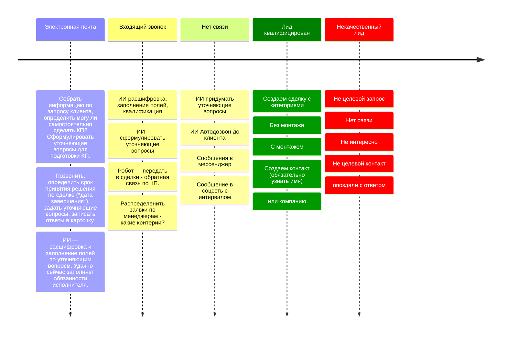
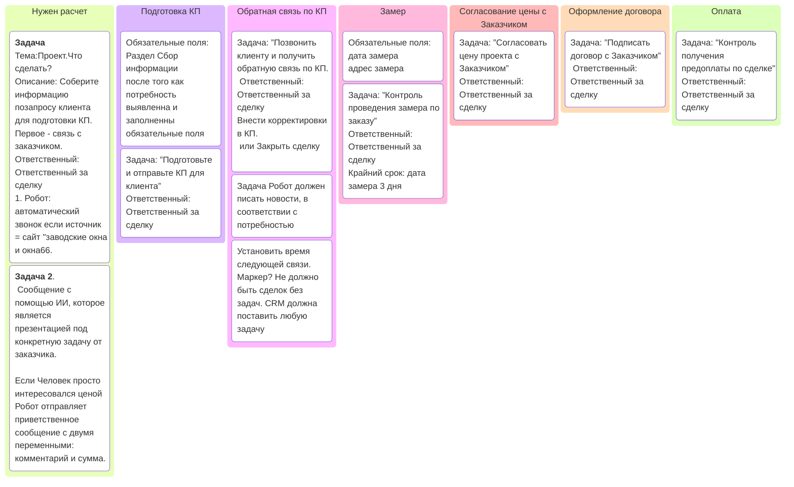
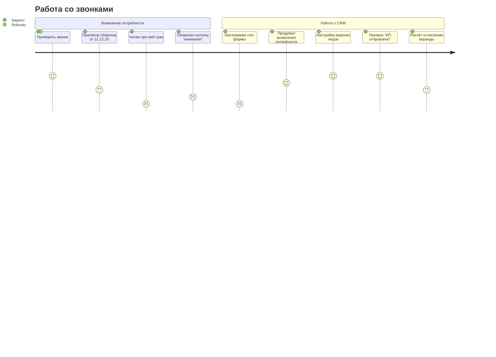

# Бизнес как процесс
Описания БП составляют для внедрения
основной принцип не сломай то что работает
описание БП очень творческая работа, в нем указывают на что обращать внимание и что нужно сделать для получения результата. Перед описанием:
- определить какие работники участвуют в рассматриваемом звене
- подробно описать действия работника
- определить какие результаты были получены
- определить ситуации где есть проблемы и детально описать
- определить кто может их решить.

1. Подробное описание работы компании в графическом и текстовом виде 
2. Модели дают увидеть сложные взаимодействия в тексте или схемах

Правило 15 минут для описания

Этапы внедрения БП цель - перевод сотрудников на более эффективную схему
1. Планировать до
2. Делать анализ после

С помощью БП можно обнаружить ошибку на этапе внедрения товара. Допустим один разбирается в остекления видах, другой в отделке, третий в коттеджах. Внедрить переключение.

#  Какие в компании существуют процессы и отношения между ними?

[Квалификация лида](scoring.md) > [Выявление потребности](выявление%20потребности.md) >  >  >  > Оплата > Монтаж > Рекламация > Сервис
Процессы объединяет их принадлежность к сущности "сделка", каждый процесс имеет свои стадии. Воронка создаётся только для процессов в которых требуется оплата, где участвуют деньги. Остальные должны быть сделаны как смартпроцессы.
[Источники лидов](Источники%20лидов.md)

Если Источник: авито, вконтакте, telegramm, форма на сайте - ИИ агент должен принять заявку и попытаться вытащить телефон. 

Лид становится сделкой когда стало понятно, что это наш клиент, то есть лид квалифицирован как качественный. 
Поэтому на воронке лидов минимум стадий, на ней важно только установление контакта и квалификация с монтажем или без монтажа чтобы этот вопрос задавался еще на этапе звонка (нажмите кнопочку 1 - если хотите расчитать стоимость окон или остекления балкона веранды террасы с монтажем своими силами, нажмите 2 - если без монтажа, нажмите 3 - если хотите стать нашим партнёром (для тех кто предлагает рекламный канал, аренду спецтехники, профиля ПВХ и тд)). 
Лиды у которых источник сайт ekb.oknaplastikovie.ru должны попадать в сделки после прохождения .

# Воронки по продукции
Под каждый случай должна быть своя воронка:
- Без монтажа — сокращённая воронка, без стадий замера. 
Отдельная воронка пока под вопросом руководителя. Монтаж сейчас имеет две воронки: с монтажем и просто производство конструкций. Как нам исключить прыжки и переключения? делаем одну воронку продажи для всей продукции?
Думали с Георгием, что если возможность деления на ИЖС и квартиры поскольку
- ИЖС требует больше внимания,
- более детальный КП
- Презентация продукта, которую мы не делаем вообще.
- Время принятия решения больше, следовательно роботы должны по другому работать, чтобы не надоедать.
 

Этапы пишутся в совершенном виде, 
ключевые этапы воронки (презентация и замер) делятся на 2 колонки 
- назначен и 
- проведен. 
На каждом этапе есть обязательные поля и обязательные задачи.

> На стадии Потребность выявленна" Добавить задачу ответственному  — Провести презентацию с чек листом по шаблону. Вторая задача — отправить КП, после выполнения которой сделка переходит на стадию КП отправленно.

Остекление балкона или лоджии, а так же террасы или коттеджа на этапе продажи начинается с расчёта стоимости работы. Что важно в процессе продаж? Как нам разделить с Георгием сделки по ответственным? Как назначать ответственного?

> На стадии КП отправленно работает чат бот.

ИЖС:
- больше внимания;
- более детальное КП;
- обязательна презентация;
- больше время принятия решения.
Возвращаемся после проработки механизмов как нам более плотно работать со сделками. Маркеры это автоматизация.

Георгий: моя задача — не дать забыться сделке, сформировать дорожную карту.
# Человек просто интересуется ценой
Стадию квалификации он проходит. Робот отправляет приветственное сообщение с двумя переменными: комментарий и сумма. Далее участвует в акциях пока не попросит не беспокоить его.

⚠️ Сейчас робот не отправляет приветственное сообщение в telegramm первым

# Вероятность сделки
Как оценить, из каких факторов складывается?
Зависит от заказчика. 
- От скорости отклика (расчёт, замер)
- От соответствия заказа профилю компании. 
- От географической удалённости. 
- Отмечаем Приоритет

## 1. Для не ответивших на звонок.
Написать сообщение в ватсап, поставить дело — удалить если не ответит. Если прислал фото — поставить дело "подготовить расчёт", в комментарий — расшифровку аудиозаписи. (дело автоматически закрывается при переводе на стадию есть расчёт)

Сегодня 25/12/12 сделал прозвон 64 контактов которым ранее делал расчёт. Из них договорился связаться весной с сколько-то.
# Правила для закрытия сделки

*Этап «Знаю»* предполагает, что клиенты узнают о вас через рекламу и PR. Задача этого этапа — сделать так, чтобы о вас узнали как можно больше людей.  
*Этап «Хочу»* связан с правильным донесением ключевых смыслов, важности и надобности вашего продукта или услуги. Важно правильно упаковать товар или услугу, чтобы они побуждали клиентов возжелать ваш продукт или услугу, которые закрывают конкретную потребность или боль.  
*Этап «Верю»* предполагает, что клиенты верят вам и испытывают к вам доверие. Доверие формируется с помощью трансляции своей экспертности, результатов клиентов и их отзывов, партнёрских рекомендаций и ярких примеров решения потребностей за счёт вашего продукта или услуги.  
*Этап «Плачу»* завершает сделку, если все три предыдущих этапа клиент успешно прошёл.
# Сделать массовую рассылку
Для воронки продажи. Просмотр последних 
Если есть заказчики которые лежат мёртвым грузом
Посыл такой: сейчас действуют зимние скидки — готовы предложить остекление и работу по сниженным ценам. Грамотно сформировать.

Классовый подход : перспективные и молчуны. Работать с whatsapp. Воздействуя акционным предложением. Поставить снежинки из звёздочек.

# Триггеры закрытия сделок
Провалено:  Источник = "в контакте", телефон не задан, дата закрытия = сегодня
## Сделка провалена
Источник = сайты и Сумма = 0 и комментарий заполнен
значит потребность выявлена и расчёт не произведён

# Бизнес-процессы:
Умные сценарии нужны для расчёта, замера, договора. Это позволит посчитать конверсию и понять на каком этапе провалы. Позволит автоматизировать  которая должна включать расчёт, замер, договор. Каждый из процессов должен иметь обязательные поля, лучше ими ограничиться. Должен создавать событие в ленте. Чтобы другие видели работу. Появился расчёт - замерщики уже приготовились решается кто поедет.
## расчёта кп (подготовка предложения) 
Стандартная задача по шаблону - чек лист: к задаче файлы: вид дома, этаж
- [ ] Подготовить расчет стоимости остекления в виде таблицы
- [ ] Отправить коммерческое предложение клиенту по почте
- [ ] Позвонить клиенту для подтверждения получения КП
- [ ] Уведомить клиента по SMS или Telegram об ожидании решения. Получить обратную связь по КП. **Какие вопросы задать?**
### 2. Для тех, кому сделан расчёт
Звонок на следующий день или Автоматическое сообщение через 1 дня, если нет ответа на звонок. Сценарии помогут работать в одной воронке из списка. Стадии будут. Сценарии помогут обрабатывать 1 сделку с сохранением текущей стадии. Сейчас на стадии "выявление потребности" есть сделки, по котором запланирован созвон в марте, апреле и т.д. Нужно перевести их в стадию "есть расчёт". Или раскидать по стадиям Есть расчёт / Ждём размеры.

## Замер
Бизнес процесс, для запуска которого необходимо заполнить поля адрес объекта (ул, дом) и телефон заказчика. БП должен передавать замерщику приоритет. Событие добавляется в ленту, чтобы замерщики видели сколько у кого замеров чтобы снять возражения. После замера к карточке сделки должны быть прикреплены 
- Четкий эскиз/фото замера с размерами.
- Текстовое поле «**Дополнения и правки по замеру**», куда замерщик вносит ВСЕ изменения к первоначальному заданию (разборчивым почерком/текстом).
- Крайний срок выполнения расчёта после замера.
- (Дополнительно) Голосовое сообщение или комментарии важно писать в чате к задаче. Важно чтобы на замере при помощи телефона менеджер мог снять фото, ввести размеры в стандартной форме шаги которой согласованы, бумажный документ присутствует. Данные из которой подтягиваются  в задачу. Фото видео проёмов, указание размеров, разговор с заказчиком. Нужна вместо скриптов при разговоре по телефону форма.

## Оформление договора
При печати документа сигнал бухгалтеру (отправить копию договора) и поставить задачу - сделать чек.

# Закрытие сделки
Причина: не смогли в срок обработать возражение
возражения список: дорого, я подумаю, нашли дешевле нейросеть в помощь
- **Сомнения в ценности**. Человек не видит явной выгоды: почему это решение стоит своих денег и времени. Особенно остро стоит вопрос, если продукт или услуга похожи на другие, но стоят дороже.
- **Недоверие**. Клиент не уверен в компании, продукте или продавце. Это может быть связано с негативным опытом самого клиента, непрозрачными условиями продажи или плохой репутацией компании.
- **Страх ошибки**. Особенно часто встречается в случае дорогих покупок или долгосрочных решений: человек боится потратить деньги зря, сделать выбор, о котором пожалеет.
- **Несвоевременность**. У клиента действительно могут быть другие приоритеты: не тот момент или нехватка бюджета — и он отказывается от покупки, даже если продукт или услуга ему интересны.
- **Не устраивает цена**. Слишком дорого — клиент планировал потратить меньше, потому что не разбирается в продукте. Бывает наоборот: смущает слишком низкая цена.
- **Не устраивает качество**. Клиент изучил продукт, и тот ему не понравился. Недовольство качеством может касаться не только товаров, но и услуг.
- **Не устраивают условия сделки**. Слишком долго ждать выполнения заказа, нет удобного способа оплаты, не нравятся условия доставки или сервисного обслуживания.
- **Пользуется услугами конкурентов**. Потенциальный покупатель — уже давно клиент другой компании. Его устраивают условия сотрудничества, качество и цены.
- **Не нужен товар/услуга**. Такое часто бывает в «холодных» продажах. Здесь важно понять, действительно ли клиент не нуждается в продукте.

Сделки срок которых подходит к завершению должны быть закрыты с одним из возражений. Даже если просто перестал выходить на связь или пропал. Как сделать автоматически чтобы в течении дня карточки закрывались. Обязательное поле в CRM на стадии **Остановка с возражением** или не **обработано возражение**. И выбор какое возражение. Если **нет связи** или **пока не нужно** можно квалифицировать как несвоевременность.